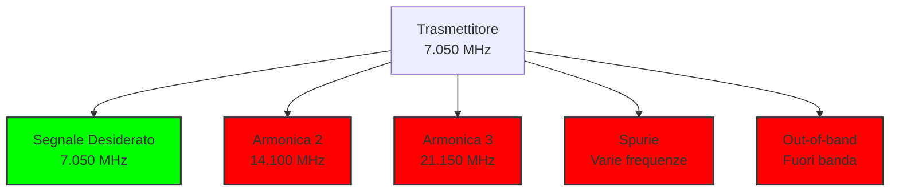
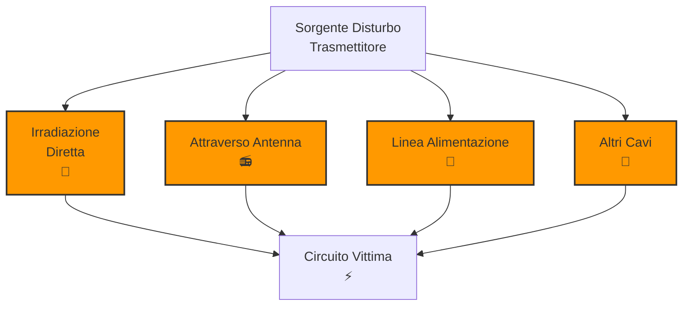

> [!WARNING]
> Questi sono **appunti personali** e possono contenere errori o imprecisioni.
> Non sostituiscono libri di testo o fonti ufficiali.
> Il materiale è soggetto a revisione continua grazie al contributo volontario della comunità.
> [Contribuisci su GitHub](https://github.com/IU6VYG/esame-radioamatori)

# 9.2 Cause dei Disturbi degli Apparecchi Elettronici: Le Radici del Problema 🔍⚠️

Benvenuti nell'analisi delle cause dei disturbi elettronici! Per combattere efficacemente i disturbi, dobbiamo prima comprenderne le origini. Dai campi elettromagnetici intensi alle irradiazioni parassite, ogni causa ha le sue caratteristiche e richiede soluzioni specifiche. Scopriamo insieme le principali fonti di interferenza e come si propagano nei nostri sistemi elettronici!

## 📡 Intensità di Campo del Trasmettitore

La potenza irradiata è la causa più ovvia di disturbi.

### Campo Elettromagnetico

L'intensità di campo E diminuisce con la distanza secondo la legge dell'inverso del quadrato.

**E = √(P × G) / (4π × d)** V/m

Dove:
- P = potenza irradiata (W)
- G = guadagno antenna (numerico)
- d = distanza (m)

### Esempio Numerico

Trasmettitore 100W (20 dBW), antenna guadagno 6 dBi (4x), distanza 1km:
E = √(100 × 4) / (12.56 × 1000) ≈ √400 / 12560 ≈ 20 / 12560 ≈ 0.0016 V/m

### Effetto sulla Vittima

- **Bloccaggio**: Se E > limite ingresso ricevitore
- **Intermodulazione**: Se multiple sorgenti
- **Desensibilizzazione**: Riduzione sensibilità

### Tabella Limiti Tipici
| Dispositivo | Limite Campo (V/m) | Effetto |
|-------------|-------------------|---------|
| Radio portatile | 1 | Bloccaggio |
| TV domestica | 3 | Interferenza |
| Apparati medici | 0.1 | Rischio sicurezza |

## 📻 Irradiazioni Non Essenziali del Trasmettitore

I trasmettitori emettono più del segnale desiderato.

### Armoniche

Multipli interi della frequenza fondamentale.

**f_armonica = n × f_fondamentale**

### Esempio

Fondamentale 7.050 MHz:
- 2ª armonica: 14.100 MHz
- 3ª armonica: 21.150 MHz
- 5ª armonica: 35.250 MHz

### Irradiazioni Parassite

- **Spurie**: Prodotti non intenzionali
- **Out-of-band**: Fuori banda assegnata
- **Intermodulazione**: Prodotti interni

### Diagramma Irradiazioni

### Cause Comuni

- **Amplificatore non lineare**: Genera armoniche
- **Filtri inadeguati**: Non sopprimono spurie
- **Alimentazione instabile**: Modulazione AM indesiderata

## 🔌 Effetti Non Desiderati sull'Apparato

I disturbi entrano nei dispositivi attraverso vari percorsi.

### All'Ingresso d'Antenna

Il percorso più diretto e problematico.

#### Meccanismi

- **Irradiazione diretta**: Campo EM colpisce antenna
- **Conduzione**: Lungo cavo antenna
- **Induzione**: In loop di terra o alimentazione

#### Protezione

- **Filtri d'ingresso**: Attenuano fuori banda
- **Limitatori**: Proteggono da sovraccarichi
- **Schermatura**: Riduce accoppiamento

### Su Altre Linee di Connessione

I disturbi si propagano attraverso cavi e connessioni.

#### Alimentazione

- **Conduzione comune**: Stessa linea elettrica
- **Induzione magnetica**: Vicino a cavi di potenza
- **Modi differenziali**: Tra conduttori

#### Interfacce

- **USB/Ethernet**: Cavi non schermati
- **Altoparlanti**: Irradiazione da cavi audio
- **Controlli remoti**: Linee di controllo

### Per Irraggiamento Diretto

Campo elettromagnetico colpisce direttamente il circuito.

#### Frequenze Interessate

- **VHF/UHF**: Facilmente irradiate
- **HF**: Meno critiche per lunghezze d'onda
- **Basse frequenze**: Facilmente schermate

#### Fonti Tipiche

- **Trasmettitori vicini**: Campi intensi
- **Linee di trasmissione**: Irradiazioni parassite
- **Apparati elettronici**: Computer, motori

### Diagramma Propagazione Disturbi

## ⚙️ Fattori che Influenzano i Disturbi

### Caratteristiche del Trasmettitore

- **Potenza**: Maggiore = più disturbo
- **Modulazione**: Alcuni modi più "puliti"
- **Frequenza**: HF più contenute, VHF/UHF più irradianti
- **Qualità**: Filtri e linearità

### Caratteristiche della Vittima

- **Sensibilità**: Più sensibile = più disturbata
- **Selettività**: Buona = meno disturbata
- **Schermatura**: Migliore = meno disturbata
- **Frequenza**: Vicina alla sorgente = più disturbata

### Ambiente

- **Distanza**: Maggiore = meno disturbo
- **Ostacoli**: Schermano il campo
- **Rumore ambientale**: Maschera i disturbi
- **Condizioni atmosferiche**: Influenza propagazione

## 📊 Misura e Quantificazione

### Strumenti per l'Analisi

- **Analizzatore di spettro**: Identifica frequenze disturbi
- **Misuratore di campo**: Quantifica intensità
- **Ricevitore scanner**: Localizza sorgenti
- **Oscilloscopio**: Analizza forma d'onda

### Parametri da Misurare

- **Livello del disturbo**: dBm o dBμV
- **Frequenza**: Esatta del disturbo
- **Tipo**: Continuo, impulsivo, modulato
- **Direzione**: Da dove arriva

### Esempio di Misura

Disturbo a 88 MHz da un trasmettitore locale:
- Livello: +20 dBm
- Tipo: Continuo modulato
- Effetto: Bloccaggio ricevitori vicini

## 🧠 Quiz di Ripasso

Testa le tue conoscenze sulle cause dei disturbi!

### Domanda 1: Come diminuisce l'intensità di campo con la distanza?
- A) Linearmente
- B) Con l'inverso della distanza
- C) Con l'inverso del quadrato della distanza
- D) Esponenzialmente

  
Risposta

  
<strong>C) Con l'inverso del quadrato della distanza</strong>

  
In spazio libero, il campo elettromagnetico diminuisce con 1/d².

### Domanda 2: Cosa sono le armoniche di un trasmettitore?
- A) Segnali desiderati
- B) Multipli interi della frequenza fondamentale
- C) Rumori atmosferici
- D) Prodotti di intermodulazione

  
Risposta

  
<strong>B) Multipli interi della frequenza fondamentale</strong>

  
Le armoniche sono frequenze multiple della portante: 2f, 3f, 4f, etc.

### Domanda 3: Qual è il percorso più critico per l'ingresso dei disturbi?
- A) Linea di alimentazione
- B) Ingresso d'antenna
- C) Cavi di controllo
- D) Schermo del dispositivo

  
Risposta

  
<strong>B) Ingresso d'antenna</strong>

  
L'antenna è progettata per ricevere segnali, quindi è il punto più vulnerabile ai disturbi.

### Domanda 4: Cosa influenza maggiormente l'irradiamento di un trasmettitore?
- A) La modulazione utilizzata
- B) La potenza di uscita
- C) La frequenza di lavoro
- D) Il tipo di antenna

  
Risposta

  
<strong>B) La potenza di uscita</strong>

  
Maggiore potenza significa maggiore campo irradiato e quindi più potenziale disturbo.

### Domanda 5: Quale strumento è più utile per identificare la frequenza di un disturbo?
- A) Multimetro
- B) Analizzatore di spettro
- C) Oscilloscopio
- D) Wattmetro

  
Risposta

  
<strong>B) Analizzatore di spettro</strong>

  
L'analizzatore di spettro mostra l'ampiezza vs frequenza, permettendo di identificare esattamente le frequenze dei disturbi.

## Conclusione

Comprendere le cause dei disturbi è essenziale per prevenirli e risolverli. Dalla potenza irradiata alle irradiazioni parassite, ogni aspetto contribuisce al quadro complessivo dell'interferenza elettromagnetica. Identificare la causa significa poter applicare la soluzione giusta! 🔍⚠️

---
<parameter name="filePath">09_Disturbi_Protezione/9.2_Cause_dei_disturbi_degli_apparecchi_elettronici.md
