# B.1 Alfabeto Fonetico: Comunicare senza Ambiguita' 📻🔠

Benvenuti nel mondo dell'alfabeto fonetico! Ogni radioamatore deve saper scandire con precisione lettere e numeri per evitare errori di comprensione. L'alfabeto fonetico NATO/ICAO e' lo standard internazionale adottato dall'UIT e utilizzato in tutte le comunicazioni radioamatoriali. Scopriamo come trasformare ogni lettera in una parola chiara e universalmente riconoscibile!

## 📜 Storia dell'Alfabeto Fonetico

L'alfabeto fonetico nasce dalla necessita' di eliminare le ambiguita' nelle comunicazioni radio e telefoniche.

### Origini

- **Prima Guerra Mondiale**: Prime versioni militari per comunicazioni in trincea
- **1927**: UIT adotta un primo alfabeto fonetico internazionale
- **1932**: Revisione con nuove parole fonetiche
- **1956**: NATO e ICAO adottano l'alfabeto attuale, ancora in uso oggi
- **Standard**: Riconosciuto da UIT, ICAO, NATO e IMO

### Perche' un Alfabeto Fonetico?

- **Chiarezza**: Elimina confusione tra lettere simili (B/D, M/N, S/F)
- **Universalita'**: Funziona in tutte le lingue e accenti
- **Affidabilita'**: Comprensibile anche con segnale debole o disturbato
- **Velocita'**: Parole scelte per essere pronunciate facilmente

### Diagramma Evoluzione Alfabeto Fonetico

```mermaid
graph LR;
    WWI["Militare<br>1914-18<br>🎖️"] --> UIT1927["UIT<br>1927<br>🌍"];
    UIT1927 --> UIT1932["UIT Revisione<br>1932<br>📝"];
    UIT1932 --> NATO1956["NATO/ICAO<br>1956<br>✈️"];
    NATO1956 --> Oggi["Standard Attuale<br>Oggi<br>📻"];
    classDef evoluzione fill:#0cf,stroke:#333,stroke-width:2px;
    class NATO1956,Oggi evoluzione;
```


## 🔤 Alfabeto Fonetico NATO/ICAO

La tabella completa dell'alfabeto fonetico come richiesto dal programma d'esame.

### Tabella Completa

| Lettera | Parola Fonetica | Pronuncia Approssimativa |
|---------|-----------------|--------------------------|
| **A** | Alfa | AL-fah |
| **B** | Bravo | BRAH-voh |
| **C** | Charlie | CHAR-lee |
| **D** | Delta | DELL-tah |
| **E** | Echo | ECK-oh |
| **F** | Foxtrot | FOKS-trot |
| **G** | Golf | GOLF |
| **H** | Hotel | hoh-TELL |
| **I** | India | IN-dee-ah |
| **J** | Juliet | JEW-lee-ett |
| **K** | Kilo | KEY-loh |
| **L** | Lima | LEE-mah |
| **M** | Mike | MIKE |
| **N** | November | no-VEM-ber |
| **O** | Oscar | OSS-cah |
| **P** | Papa | pah-PAH |
| **Q** | Quebec | keh-BECK |
| **R** | Romeo | ROW-me-oh |
| **S** | Sierra | see-ERR-ah |
| **T** | Tango | TANG-go |
| **U** | Uniform | YOU-nee-form |
| **V** | Victor | VIK-tah |
| **W** | Whiskey | WISS-key |
| **X** | X-Ray | ECKS-ray |
| **Y** | Yankee | YANG-key |
| **Z** | Zulu | ZOO-loo |

### Diagramma Gruppi Fonetici


## 🔢 Numeri Fonetici

Anche i numeri hanno una pronuncia standard per le comunicazioni radio.

### Tabella Numeri

| Cifra | Pronuncia Standard | Esempio d'Uso |
|-------|-------------------|---------------|
| **0** | ZE-ro | Frequenza 14.0 = uno quattro punto ze-ro |
| **1** | WUN | S1 = esse wun |
| **2** | TOO | 20m = too ze-ro metri |
| **3** | TREE | 3.5 MHz = tree punto cinque |
| **4** | FOW-er | 40m = fow-er ze-ro |
| **5** | FIFE | S5 = esse fife |
| **6** | SIX | 6m = six metri |
| **7** | SEV-en | 7 MHz = sev-en |
| **8** | AIT | 8 = ait |
| **9** | NIN-er | 9 = nin-er |

### Punti e Separatori

| Simbolo | Pronuncia | Esempio |
|---------|-----------|---------|
| **.** (punto) | DAY-SEE-MAL | 14.250 = wun fow-er day-see-mal too fife ze-ro |
| **/** (barra) | STROKE | IK0/P = India Kilo ze-ro stroke Papa |

## 📻 Utilizzo Pratico nell'Attivita' Radioamatoriale

### Scandire un Indicativo di Chiamata

L'uso piu' frequente dell'alfabeto fonetico e' la comunicazione dell'indicativo di chiamata.

**Esempio: IU6VYG**
> India Uniform Six Victor Yankee Golf

**Esempio: IK0AAA**
> India Kilo Zero Alfa Alfa Alfa

### Scandire una Frequenza

**Esempio: 14.250 MHz**
> Wun Fow-er Day-see-mal Too Fife Ze-ro Megahertz

### Scandire il QTH (Localita')

**Esempio: ROMA**
> Romeo Oscar Mike Alfa

### Diagramma Esempio QSO con Spelling


## ⚠️ Errori Comuni da Evitare

### Parole Fonetiche Errate

| Lettera | Corretto | Errore Comune | Perche' e' Sbagliato |
|---------|----------|---------------|---------------------|
| **A** | Alfa | Apple, Ancona | Non standard internazionale |
| **B** | Bravo | Baker, Bologna | Versione obsoleta o locale |
| **I** | India | Italy, Imola | Confusione con nomi locali |
| **N** | November | Nancy, Napoli | Non riconosciuto internazionalmente |
| **S** | Sierra | Sugar, Savona | Versione obsoleta o locale |

### Regole Fondamentali

1. **Usare SEMPRE l'alfabeto NATO/ICAO** nelle comunicazioni internazionali
2. **Non inventare** parole fonetiche personali
3. **Pronunciare chiaramente** ogni sillaba
4. **Separare** le parole fonetiche con una breve pausa
5. **Ripetere** l'indicativo almeno una volta per conferma

## 🌍 Confronto con Altri Alfabeti Fonetici

### Alfabeto Italiano (non standard per radio)

| Lettera | NATO (Standard) | Italiano (NON usare in radio) |
|---------|-----------------|-------------------------------|
| A | Alfa | Ancona |
| B | Bravo | Bologna |
| C | Charlie | Como |
| F | Foxtrot | Firenze |
| M | Mike | Milano |
| N | November | Napoli |
| R | Romeo | Roma |
| T | Tango | Torino |

> **Attenzione**: L'alfabeto telefonico italiano (Ancona, Bologna, Como...) **NON** deve essere utilizzato nelle comunicazioni radioamatoriali internazionali. Si usa esclusivamente l'alfabeto NATO/ICAO.

## 📊 Tabella Riassuntiva per lo Studio

### Vista Compatta dell'Alfabeto


```
A = Alfa       J = Juliet      S = Sierra
B = Bravo      K = Kilo        T = Tango
C = Charlie    L = Lima        U = Uniform
D = Delta      M = Mike        V = Victor
E = Echo       N = November    W = Whiskey
F = Foxtrot    O = Oscar       X = X-Ray
G = Golf       P = Papa        Y = Yankee
H = Hotel      Q = Quebec      Z = Zulu
I = India      R = Romeo
```

> Questa disposizione rispecchia esattamente il formato del programma d'esame ufficiale (Sub Allegato D, All.26).

## 🧠 Quiz di Ripasso

Testa le tue conoscenze sull'alfabeto fonetico!

### Domanda 1: Come si scandisce la lettera "Q" nell'alfabeto fonetico NATO?
- A) Queen
- B) Quebec
- C) Quito
- D) Quantum

<details>
  <summary>Risposta</summary>
  <p><strong>B) Quebec</strong></p>
  <p>La lettera Q corrisponde a "Quebec" nell'alfabeto fonetico NATO/ICAO, pronunciato "keh-BECK".</p>
</details>

### Domanda 2: Quale parola fonetica corrisponde alla lettera "W"?
- A) William
- B) Washington
- C) Whiskey
- D) Walter

<details>
  <summary>Risposta</summary>
  <p><strong>C) Whiskey</strong></p>
  <p>"Whiskey" e' la parola fonetica NATO per la lettera W, pronunciata "WISS-key".</p>
</details>

### Domanda 3: Come si scandisce l'indicativo IK0AAA?
- A) Italia Kappa Zero Ancona Ancona Ancona
- B) India Kilo Zero Alfa Alfa Alfa
- C) Italy King Zero Apple Apple Apple
- D) India Kilo Zero Alpha Alpha Alpha

<details>
  <summary>Risposta</summary>
  <p><strong>B) India Kilo Zero Alfa Alfa Alfa</strong></p>
  <p>Si utilizza l'alfabeto NATO: I=India, K=Kilo, 0=Zero, A=Alfa. Nota: "Alfa" (non "Alpha") e' la grafia ufficiale NATO.</p>
</details>

### Domanda 4: Perche' si usa l'alfabeto fonetico nelle comunicazioni radio?
- A) Per sembrare professionali
- B) Per eliminare ambiguita' tra lettere simili
- C) Per rallentare le comunicazioni
- D) Per tradizione militare

<details>
  <summary>Risposta</summary>
  <p><strong>B) Per eliminare ambiguita' tra lettere simili</strong></p>
  <p>Lettere come B/D, M/N, S/F suonano molto simili via radio, specialmente con segnale debole o disturbato. L'alfabeto fonetico elimina ogni possibilita' di confusione.</p>
</details>

### Domanda 5: In quale anno e' stato adottato l'attuale alfabeto fonetico NATO/ICAO?
- A) 1927
- B) 1945
- C) 1956
- D) 1970

<details>
  <summary>Risposta</summary>
  <p><strong>C) 1956</strong></p>
  <p>L'alfabeto fonetico NATO/ICAO attualmente in uso e' stato adottato nel 1956 e da allora e' rimasto invariato, diventando lo standard mondiale per le comunicazioni radio.</p>
</details>

## Conclusione

L'alfabeto fonetico NATO/ICAO e' uno strumento fondamentale per ogni radioamatore. La sua padronanza garantisce comunicazioni chiare e senza ambiguita' in qualsiasi condizione di propagazione e con operatori di qualsiasi nazionalita'. Memorizzare le 26 parole fonetiche e' il primo passo per entrare nel mondo delle radiocomunicazioni internazionali! 📻🔠

---
