> [!WARNING]
> Questi sono **appunti personali** e possono contenere errori o imprecisioni.
> Non sostituiscono libri di testo o fonti ufficiali.
> Il materiale è soggetto a revisione continua grazie al contributo volontario della comunità.
> [Contribuisci su GitHub](https://github.com/IU6VYG/esame-radioamatori)

# B.3 Abbreviazioni Operative: La Lingua Concisa dei Radioamatori 📻🔤

Benvenuti nel mondo delle abbreviazioni operative! Oltre al codice Q, i radioamatori utilizzano un ricco vocabolario di abbreviazioni per rendere le comunicazioni più rapide ed efficienti. Queste brevi sequenze di lettere permettono di esprimere concetti complessi in pochi caratteri, essenziale per le comunicazioni in tempo reale. Scopriamo insieme questo linguaggio che rende l'etere più fluido e comprensibile!

## 📜 Origine delle Abbreviazioni

Le abbreviazioni radioamatoriali nascono dalla necessità di velocità nelle comunicazioni telegrafiche.

### Evoluzione Storica

- **Telegrafo**: Prime abbreviazioni per risparmiare tempo
- **Radiotelegrafia**: Adattamento alle onde radio
- **CW (Morse)**: Abbreviazioni essenziali per la telegrafia
- **Telefonia**: Estensione alle comunicazioni vocali
- **Digitale**: Adozione nei modi digitali moderni

### Perché Abbreviare?

- **Velocità**: Comunicazioni più rapide
- **Chiarezza**: Eliminazione ambiguità
- **Efficienza**: Riduzione tempo trasmissione
- **Tradizione**: Parte della cultura radioamatoriale

### Diagramma Evoluzione Abbreviazioni

```mermaid
graph LR;
    Telegrafo["Telegrafo<br>1850s<br>⚡"] --> Radiotelegrafo["Radiotelegrafo<br>1900s<br>📡"];
    Radiotelegrafo --> CW["CW/Morse<br>1910s<br>·-·"];
    CW --> SSB["SSB/Voce<br>1950s<br>🎙️"];
    SSB --> Digitale["Digitale<br>2000s<br>💻"];
    Digitale --> Futuro["Futuro<br>🤖"];
    classDef evoluzione fill:#0cf,stroke:#333,stroke-width:2px;
    class CW,SSB,Digitale evoluzione;
```

## 📊 Abbreviazioni di Base

### Controllo del Traffico

| Abbreviazione | Significato | Uso | Esempio |
|---------------|-------------|-----|---------|
| **AR** | Fine della trasmissione | Chiusura messaggio | 73 AR |
| **BK** | Break (interruzione) | Interrompere trasmissione | BK per emergenza |
| **K** | Invito a trasmettere | "Over" | IK0AAA K |
| **R** | Ricevuto/Roger | Conferma ricezione | R 73 |
| **VA** | Parola dopo | Aspetta parola successiva | VA |

### Chiamate e Risposte

| Abbreviazione | Significato | Uso | Esempio |
|---------------|-------------|-----|---------|
| **CQ** | Chiamata generale | Chiamare tutte le stazioni | CQ CQ DE IK0AAA |
| **DE** | Da (provenienza) | Indicare mittente | IK0AAA DE I1BBB |
| **DX** | Distanza | Contatto a lunga distanza | DX from Italy |
| **OM** | Old Man (uomo) | Saluto amichevole | Hello OM |
| **YL** | Young Lady (donna) | Saluto per operatrice | 73 YL |

### Diagramma Flusso Conversazione

## 📈 Abbreviazioni Tecniche

### Modi di Trasmissione

| Abbreviazione | Significato | Descrizione |
|---------------|-------------|-------------|
| **CW** | Continuous Wave | Telegrafia Morse |
| **SSB** | Single Side Band | Banda laterale unica |
| **AM** | Amplitude Modulation | Modulazione ampiezza |
| **FM** | Frequency Modulation | Modulazione frequenza |
| **RTTY** | Radio Teletype | Telegrafia radio |
| **PSK** | Phase Shift Keying | Modulazione PSK |
| **FT8** | Franke-Taylor 8 | Modo digitale |

### Parametri del Segnale

| Abbreviazione | Significato | Scala/Valori |
|---------------|-------------|--------------|
| **RST** | Readability-Strength-Tone | 599 (perfetto) |
| **QRN** | Rumori atmosferici | 1-5 (5=forti) |
| **QRM** | Interferenze artificiali | 1-5 (5=forti) |
| **SNR** | Signal-to-Noise Ratio | dB (più alto meglio) |
| **SWR** | Standing Wave Ratio | 1.0 (perfetto) |

### Esempio RST
- **599**: Segnale eccellente (5=intelligibilità, 9=forza, 9=tono)
- **459**: Intelligibilità buona, forza discreta, tono buono
- **229**: Intelligibilità scarsa, forza debole, tono discreto

## 🎯 Abbreviazioni Operative Comuni

### Saluti e Chiusure

| Abbreviazione | Significato | Uso |
|---------------|-------------|-----|
| **73** | Best regards | Migliori auguri |
| **88** | Love and kisses | Per operatrici |
| **TU** | Thank you | Grazie |
| **EE** | Fine della trasmissione | Chiusura |
| **HW** | How? Come? | Domanda |

### Richieste e Conferme

| Abbreviazione | Significato | Uso |
|---------------|-------------|-----|
| **PSE** | Please | Per favore |
| **AGN** | Again | Ripeti |
| **QSL** | Conferma | Carta QSL |
| **QRZ** | Chi mi chiama? | Durante pile-up |
| **MSG** | Message | Messaggio |

### Condizioni e Problemi

| Abbreviazione | Significato | Uso |
|---------------|-------------|-----|
| **NIL** | Nothing | Niente |
| **FB** | Fine Business | Ottimo |
| **WX** | Weather | Meteo |
| **GA** | Good Afternoon | Buon pomeriggio |
| **GM** | Good Morning | Buon giorno |

## 🏆 Abbreviazioni nei Contest

Durante le gare radioamatoriali, le abbreviazioni diventano essenziali per la velocità.

### Sequenza Contest Tipica

1. **Chiamata**: CQ TEST DE IK0AAA TEST
2. **Risposta**: IK0AAA DE I1BBB 5NN 001
3. **Conferma**: TU 5NN 001 QRZ?
4. **Nuovo**: I1BBB DE IK0AAA 5NN 002

### Abbreviazioni Contest Comuni

| Abbreviazione | Significato | Uso |
|---------------|-------------|-----|
| **TEST** | Contest | Indica gara |
| **5NN** | 599 | Rapporto perfetto |
| **NR** | Number | Numero seriale |
| **TU** | Thank you | Grazie |
| **QRZ?** | Chi mi chiama? | Richiesta chiamata |

### Esempio Contest
**Stazione A:** CQ WW DX TEST DE IK0AAA TEST K  
**Stazione B:** IK0AAA DE I1BBB 5NN 001 K  
**Stazione A:** I1BBB TU 5NN 001 QRZ? K  
**Stazione B:** QRZ DE I1BBB K  

## 🌍 Abbreviazioni Internazionali

### Lingua Franca Radioamatoriale

- **Inglese**: Base comune mondiale
- **Fonetica**: Alfabeto fonetico NATO
- **Numeri**: Pronuncia chiara (tree invece di three)

### Alfabeto Fonetico NATO

| Lettera | Pronuncia | Lettera | Pronuncia |
|---------|-----------|---------|-----------|
| A | Alfa | N | November |
| B | Bravo | O | Oscar |
| C | Charlie | P | Papa |
| D | Delta | Q | Quebec |
| E | Echo | R | Romeo |
| F | Foxtrot | S | Sierra |
| G | Golf | T | Tango |
| H | Hotel | U | Uniform |
| I | India | V | Victor |
| J | Juliet | W | Whiskey |
| K | Kilo | X | X-ray |
| L | Lima | Y | Yankee |
| M | Mike | Z | Zulu |

### Esempio Uso Fonetica
- **IK0AAA**: India Kilo Zero Alfa Alfa Alfa
- **14.250**: One Four Decimal Two Five Zero

## 💻 Abbreviazioni Digitali

Con l'avvento dei modi digitali, nuove abbreviazioni sono entrate in uso.

### Modi Digitali Comuni

| Abbreviazione | Significato | Descrizione |
|---------------|-------------|-------------|
| **FT8** | Franke-Taylor 8 | Modo digitale debole segnale |
| **JT65** | Joe Taylor 65 | Predecessore FT8 |
| **WSJT** | Weak Signal JT | Suite software digitale |
| **FLDIGI** | Fast Light Digital | Software multimodo |
| **PSK31** | Phase Shift Keying 31 | Modo PSK popolare |

### Abbreviazioni Chat Digitali

| Abbreviazione | Significato | Uso |
|---------------|-------------|-----|
| **TNX** | Thanks | Grazie |
| **CU** | See you | Ci vediamo |
| **GL** | Good luck | Buona fortuna |
| **HI** | High | Saluto |
| **DR** | Dear | Caro |

## 📝 Uso Pratico delle Abbreviazioni

### Costruzione di un Messaggio

**Messaggio completo:** "Ciao, sono IK0AAA da Roma. Il mio segnale è buono. Puoi confermare ricezione?"

**Con abbreviazioni:** "HI IK0AAA ROME FB PSE QSL"

### Risparmio di Tempo

- **Messaggio normale**: ~15 secondi
- **Con abbreviazioni**: ~5 secondi
- **Risparmio**: 70% tempo trasmissione

### Diagramma Efficienza

```mermaid
graph LR;
    MessaggioLungo["Messaggio Lungo<br>'Good morning, this is IK0AAA from Rome'"] --> TempoLungo["15 secondi<br>🎙️"];
    MessaggioCorto["Abbreviato<br>'GM IK0AAA ROME'"] --> TempoCorto["5 secondi<br>⚡"];
    TempoLungo --> Risparmio["Risparmio 70%<br>💰"];
    TempoCorto --> Risparmio;
    classDef efficiente fill:#0f0,stroke:#333,stroke-width:2px;
    class MessaggioCorto,TempoCorto efficiente;
```

## 🎓 Apprendimento delle Abbreviazioni

### Metodo di Studio

1. **Gruppi logici**: Studiare per categorie
2. **Pratica**: Usare in QSO reali
3. **Contesti**: Imparare l'uso appropriato
4. **Aggiornamenti**: Seguire evoluzione

### Risorse di Apprendimento

- **Manuali ARI**: Guide ufficiali italiane
- **Siti web**: Database online
- **Gruppi locali**: Pratica con OM esperti
- **Log personali**: Revisione QSO

## 🧠 Quiz di Ripasso

Testa le tue conoscenze sulle abbreviazioni operative!

### Domanda 1: Cosa significa "CQ"?
- A) Chiusura comunicazione
- B) Chiamata generale
- C) Conferma ricezione
- D) Cambio frequenza

  
Risposta

  
<strong>B) Chiamata generale</strong>

  
CQ significa "Chiamata a tutte le stazioni" ed è usato per chiamare chiunque.

### Domanda 2: Qual è il significato di "RST 599"?
- A) Segnale debole
- B) Segnale perfetto
- C) Segnale variabile
- D) Segnale disturbato

  
Risposta

  
<strong>B) Segnale perfetto</strong>

  
RST 599 indica intelligibilità eccellente (5), forza massima (9), tono perfetto (9).

### Domanda 3: Cosa significa "PSE"?
- A) Perfavore
- B) Per favore
- C) Prego
- D) Perfetto

  
Risposta

  
<strong>B) Per favore</strong>

  
PSE è l'abbreviazione di "Please" (per favore).

### Domanda 4: Quale abbreviazione si usa per chiudere un QSO?
- A) CQ
- B) K
- C) 73
- D) BK

  
Risposta

  
<strong>C) 73</strong>

  
73 significa "Best regards" (migliori auguri) e chiude amichevolmente il contatto.

### Domanda 5: Cosa indica "BK" in una trasmissione?
- A) Inizio trasmissione
- B) Fine trasmissione
- C) Interruzione per emergenza
- D) Cambio modalità

  
Risposta

  
<strong>C) Interruzione per emergenza</strong>

  
BK significa "Break" e permette di interrompere una trasmissione in corso per priorità.

## Conclusione

Le abbreviazioni operative sono il collante che tiene unite le comunicazioni radioamatoriali mondiali. Dalla loro origine telegrafica alla loro evoluzione digitale, continuano a rendere possibile lo scambio rapido e preciso di informazioni attraverso l'etere. Imparare questo linguaggio significa diventare cittadini dell'etere, capaci di comunicare efficacemente con radioamatori di ogni paese e cultura! 📻🔤
