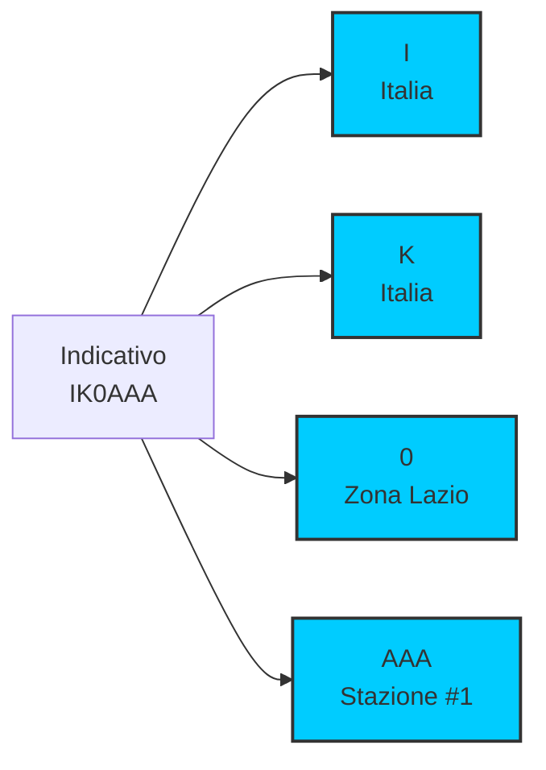
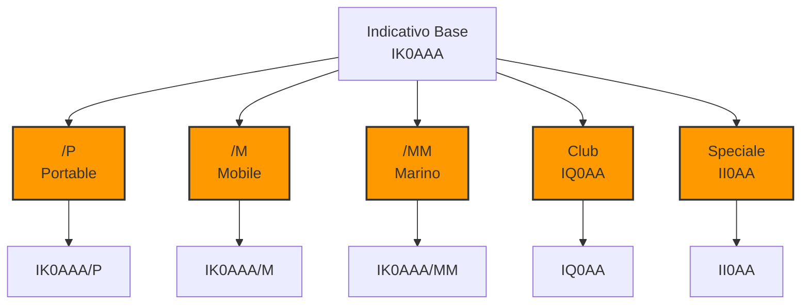

# B.5 Indicativi di Chiamata: La Nostra Identita' nell'Etere 📻🆔

Benvenuti nel mondo degli indicativi di chiamata! L'indicativo è molto più di una semplice sigla: è la nostra identità unica nell'etere, il nostro passaporto radioamatoriale che ci identifica in tutto il mondo. Scopriamo insieme la struttura di questi codici speciali, le regole internazionali e come utilizzarli correttamente per comunicazioni sicure e ordinate!

## 🆔 Che cos'è un Indicativo di Chiamata?

L'**indicativo di chiamata** è un codice alfanumerico unico assegnato a ogni stazione radioamatoriale autorizzata.

### Funzioni Principali

- **Identificazione**: Distinguere una stazione dalle altre
- **Localizzazione**: Indicare il paese di origine
- **Tracciabilità**: Permettere verifiche e controlli
- **Legalità**: Prova di autorizzazione valida

### Esempio Base
- **IK0AAA**: Radioamatore italiano (IK = Italia, 0 = Lazio, AAA = numero progressivo)
- **DL1ABC**: Radioamatore tedesco (DL = Germania, 1 = classe, ABC = suffisso)

## 🔤 Struttura degli Indicativi

Gli indicativi seguono regole internazionali standardizzate dall'ITU.

### Formato Generale

**Prefisso + Numero + Suffisso**

- **Prefisso**: 1-3 lettere (paese/regione)
- **Numero**: 1 cifra (zona/classe)
- **Suffisso**: 1-3 lettere (numero stazione)

### Esempi di Struttura
```
IK0AAA
││││││
│││││└─ Suffisso (AAA)
│││└── Numero zona (0)
││└─── Prefisso nazionale (K)
│└──── Prefisso internazionale (I)
```

### Diagramma Struttura Indicativo


## 🌍 Prefissi Internazionali

Ogni paese ha prefissi assegnati dall'ITU per identificare la nazionalità.

### Prefissi Principali

| Paese | Prefisso | Note |
|-------|----------|------|
| **Italia** | I, IK, IU, IW, IZ, IS, IT | Blocco ITU: IAA-IZZ |
| **Stati Uniti** | K, W, N, AA-AL | K = est, W = ovest |
| **Germania** | DL, DM, DN, DO | DL = principale |
| **Regno Unito** | G, M, 2E | G = Inghilterra |
| **Francia** | F | Singolo prefisso |
| **Giappone** | JA-JS | JA = principale |
| **Russia** | UA-UI | UA = europeo |

### Zone Radioamatoriali Italiane

| Zona | Regioni | Prefissi |
|------|---------|----------|
| **0** | Lazio, Umbria | I0, IK0, IU0, IW0, IZ0 |
| **1** | Piemonte, Valle d'Aosta, Liguria | I1, IK1, IU1, IW1, IZ1 |
| **2** | Lombardia | I2, IK2, IU2, IW2, IZ2 |
| **3** | Veneto, Trentino-Alto Adige, Friuli Venezia Giulia | I3, IK3, IU3, IW3, IZ3 |
| **4** | Emilia-Romagna | I4, IK4, IU4, IW4, IZ4 |
| **5** | Toscana | I5, IK5, IU5, IW5, IZ5 |
| **6** | Marche, Abruzzo | I6, IK6, IU6, IW6, IZ6 |
| **7** | Puglia, Basilicata (Matera) | I7, IK7, IU7, IW7, IZ7 |
| **8** | Basilicata (Potenza), Campania, Calabria, Molise | I8, IK8, IU8, IW8, IZ8 |
| **9** | Sicilia | IT9, IW9 |
| **0** | Sardegna | IS0 |

:::note
I prefissi IQ sono riservati alle sezioni ARI, IR ai ripetitori e agli eventi, mentre IB, II, IO, IP, IY vengono assegnati temporaneamente per contest e manifestazioni speciali.
:::

## 📊 Classi di Licenza e Indicativi

### Italia: Sistema Attuale

Dal 2003, l'Italia ha adottato un sistema basato sull'**Autorizzazione Generale**:

| Classe | Indicativo | Esempio | Potenza Max |
|--------|------------|---------|-------------|
| **Classe A (HAREC)** | Ix0YYY | IK0AAA | 500W |

:::info
Per approfondimenti sul sistema di licenze italiano, consulta la sezione [Legislazione Nazionale](/C_Regolamentazione/Legislazione_Nazionale).
:::

### Altri Paesi: Sistemi Diversi

- **USA**: K1AAA (novizio), N1AAA (generale)
- **UK**: M0AAA (fondamentale), 2E0AAA (intermedio)
- **Germania**: DL1AAA (Classe A), DK1AAA (Classe E)

## 🔄 Utilizzo degli Indicativi

### Regole di Identificazione

1. **Inizio trasmissione**: Identificarsi entro 10 minuti
2. **Fine trasmissione**: Identificarsi alla chiusura
3. **Cambio frequenza**: Identificarsi sul nuovo canale
4. **Contest**: Identificarsi ogni 10 minuti

### Identificazione Corretta

**Esempio QSO:**
- IK0AAA: "CQ CQ DE IK0AAA K"
- I1BBB: "IK0AAA DE I1BBB GM OM UR RST 599 K"
- IK0AAA: "I1BBB DE IK0AAA R RST 599 TNX FER QSO 73 ES CUAGN IK0AAA"

### Errori Comuni da Evitare

- **Identificazione incompleta**: Solo "IK0" invece di "IK0AAA"
- **Identificazione ritardata**: Oltre 10 minuti senza ID
- **Identificazione confusa**: Mescolare indicativi diversi

## 🗺️ Indicativi Speciali

### Utilizzo Temporaneo

Quando si opera fuori dalla propria zona, si aggiungono suffissi speciali.

#### Suffissi Standard

| Suffisso | Significato | Esempio |
|----------|-------------|---------|
| **/P** | Portable | IK0AAA/P |
| **/M** | Mobile | IK0AAA/M |
| **/MM** | Maritime Mobile | IK0AAA/MM |
| **/AM** | Aeronautical Mobile | IK0AAA/AM |

#### Esempi Pratici

- **In vacanza in Germania**: DK/IK0AAA/P
- **Da auto in Sicilia**: IT9/IK0AAA/M
- **Da barca**: IK0AAA/MM

### Indicativi Club e Speciali

- **IQ0AA**: Stazione club ARI Roma
- **II0AA**: Stazione speciale (es. anniversari)
- **IR0AA**: Stazione ripetitore

### Diagramma Indicativi Speciali


## 🌐 Indicativi Internazionali

### Prefissi per Continente

| Continente | Esempi Prefissi | Note |
|------------|-----------------|------|
| **Europa** | I, OE, ON, OZ, PA | Densità alta |
| **Nord America** | K, W, N, VE, XE | USA/Canada/Messico |
| **Asia** | JA, BY, HL, HS, VU | Giappone, Cina, Corea |
| **Africa** | 5H, 6W, 7P, 9J, ZS | Diversità culturale |
| **Oceania** | VK, ZL, DU, YB | Australia, Nuova Zelanda |
| **Sud America** | PY, LU, CE, PP | Portoghese/Spagnolo |

### Indicativi Notabili

- **VK1AA**: Primo indicativo australiano
- **W1AW**: Stazione ufficiale ARRL USA
- **GB2RS**: Stazione reale britannica
- **IY1SP**: Stazione principe italiano

## 📋 Regole di Assegnazione

### In Italia

1. **Regione**: Determina il prefisso zona
2. **Classe**: Influenza disponibilità suffissi
3. **Disponibilità**: Assegnazione progressiva
4. **Vanity**: Possibilità di scegliere suffisso (costo aggiuntivo)

### Procedura di Assegnazione

1. **Esame superato**: Licenza rilasciata
2. **Richiesta indicativo**: Specificare preferenze
3. **Assegnazione**: Dal Ministero o ARI
4. **Registrazione**: Nel database internazionale

## 🎯 Uso negli Scambi

### Protocollo Standard

1. **Chiamata**: CQ DE [TUO INDICATIVO]
2. **Risposta**: [TUO] DE [MIO] [SALUTO]
3. **Scambio**: RST, QTH, nome, etc.
4. **Chiusura**: 73 [TUO] DE [MIO]

### Esempio Completo

**Stazione A:** CQ DX DE IK0AAA K  
**Stazione B:** IK0AAA DE DL1ABC K  
**Stazione A:** DL1ABC DE IK0AAA GM HANS UR 599 599 QTH ROME ITALY OP MARIO K  
**Stazione B:** IK0AAA DE DL1ABC R 599 599 QTH BERLIN GERMANY OP HANS TNX FER QSO HPE CUAGN 73 ES DX DL1ABC  
**Stazione A:** DL1ABC DE IK0AAA 73 TU HANS CUAGN IK0AAA

## 🔍 Verifica Indicativi

### Database Internazionali

- **QRZ.com**: Database globale
- **ClubLog**: Verifica contatti
- **LoTW**: Logbook elettronico ARRL
- **eQSL**: Conferme elettroniche

### Importanza della Verifica

- **Autenticità**: Confermare legalità stazione
- **Premi**: Per DXCC, WAZ, etc.
- **Sicurezza**: Evitare stazioni pirata
- **Educazione**: Imparare da altri

## 🧠 Quiz di Ripasso

Testa le tue conoscenze sugli indicativi di chiamata!

### Domanda 1: Cosa significa "IK0AAA"?
- A) Stazione italiana, zona Lazio, numero 1
- B) Stazione tedesca, zona 0, numero AAA
- C) Stazione americana, zona K, numero 0AAA
- D) Stazione giapponese, zona 0, numero AAA

<details>
  <summary>Risposta</summary>
  <p><strong>A) Stazione italiana, zona Lazio, numero 1</strong></p>
  <p>IK = Italia, 0 = Lazio (Roma), AAA = primo suffisso disponibile.</p>
</details>

### Domanda 2: Quale suffisso si aggiunge per indicare funzionamento portatile?
- A) /P
- B) /M
- C) /MM
- D) /AM

<details>
  <summary>Risposta</summary>
  <p><strong>A) /P</strong></p>
  <p>/P significa Portable, usato quando si opera da posizione temporanea.</p>
</details>

### Domanda 3: Ogni quanto tempo deve identificarsi una stazione radioamatore?
- A) Ogni 5 minuti
- B) Ogni 10 minuti
- C) Ogni 15 minuti
- D) Solo all'inizio e fine

<details>
  <summary>Risposta</summary>
  <p><strong>B) Ogni 10 minuti</strong></p>
  <p>Le normative richiedono identificazione almeno ogni 10 minuti di trasmissione continua.</p>
</details>

### Domanda 4: Cosa indica il prefisso "DL" in un indicativo?
- A) Italia
- B) Germania
- C) Francia
- D) Spagna

<details>
  <summary>Risposta</summary>
  <p><strong>B) Germania</strong></p>
  <p>DL è il prefisso assegnato alla Germania dall'ITU.</p>
</details>

### Domanda 5: Quale indicativo avrebbe un radioamatore italiano operante da mobile in Sicilia?
- A) IK0AAA
- B) IT9/IK0AAA
- C) IK0AAA/IT9
- D) IT9/IK0AAA/M

<details>
  <summary>Risposta</summary>
  <p><strong>D) IT9/IK0AAA/M</strong></p>
  <p>IT9 = prefisso Sicilia, /M = mobile, preceduto dall'indicativo base.</p>
</details>

## Conclusione

Gli indicativi di chiamata sono il nostro biglietto da visita nell'etere mondiale. Dalla loro struttura precisa alle regole di utilizzo, rappresentano l'ordine e la legalità delle comunicazioni radioamatoriali. Utilizzarli correttamente significa rispettare la comunità globale e garantire che ogni trasmissione sia identificabile e tracciabile. Il nostro indicativo non è solo un codice: è la nostra firma nell'etere! 📻🆔

---
