# C.1 Regolamento delle Radiocomunicazioni dell'UIT: Le Regole Globali 📻🌍

Benvenuti nel mondo delle normative internazionali delle radiocomunicazioni! L'**Unione Internazionale delle Telecomunicazioni (UIT)** è l'organizzazione delle Nazioni Unite che coordina l'uso globale dello spettro radioelettrico. Come radioamatori, dobbiamo conoscere queste regole per operare legalmente e rispettosamente. Scopriamo insieme il quadro normativo che governa le nostre trasmissioni!

## 🏛️ Che cos'è l'UIT?

L'**Unione Internazionale delle Telecomunicazioni (UIT)** è un'agenzia specializzata delle Nazioni Unite fondata nel 1865. Coordina l'uso globale delle telecomunicazioni e dello spettro radioelettrico.

### Organizzazione dell'UIT

- **Sede**: Ginevra, Svizzera
- **186 paesi membri**: Quasi tutti i paesi del mondo
- **3 settori principali**:
  - UIT-R (Radiocomunicazioni)
  - UIT-T (Telecomunicazioni standardizzazione)
  - UIT-D (Sviluppo)

### Diagramma Organizzazione UIT
```mermaid
graph TD;
    NazionißUnite["Nazioni Unite<br>🏛️"] --> UIT["Unione Internazionale<br>delle Telecomunicazioni<br>UIT"];
    UIT --> UIT_R["UIT-R<br>Radiocomunicazioni"];
    UIT --> UIT_T["UIT-T<br>Standardizzazione"];
    UIT --> UIT_D["UIT-D<br>Sviluppo"];
    UIT_R --> Radioamatori["Servizio<br>Radioamatore"];
    Radioamatori --> Regolamenti["Regolamenti<br>delle<br>Radiocomunicazioni"];
```

## 📻 Definizione del Servizio di Radioamatore

Il **Regolamento delle Radiocomunicazioni** definisce il servizio di radioamatore all'Articolo 1.56:

*"Servizio di radiocomunicazioni destinato ad essere utilizzato esclusivamente a scopo personale, senza scopo di lucro, da persone debitamente autorizzate che si interessano alla tecnica delle radiocomunicazioni semplicemente per proprio diletto e senza fini finanziari."*

### Caratteristiche Principali

- **Scopo personale**: Solo per diletto, non commerciale
- **Senza lucro**: Nessun guadagno finanziario
- **Tecnica**: Interesse per la radiotecnica
- **Autorizzazione**: Richiede licenza valida

### Servizio di Radioamatore via Satellite

L'Articolo 1.57 definisce il servizio di radioamatore via satellite:

*"Servizio di radiocomunicazioni nel quale le stazioni spaziali possono essere utilizzate da radioamatori."*

**Caratteristiche:**
- Utilizzo di satelliti per comunicazioni radioamatore
- Coordinamento internazionale necessario
- Bande dedicate (es. 145/435 MHz)

## 🏠 Definizione della Stazione di Radioamatore

L'Articolo 1.81 definisce la stazione di radioamatore:

*"Stazione di servizio di radioamatore."*

### Componenti di una Stazione Radioamatore

1. **Stazione trasmittente**: Apparato per generare e modulare il segnale
2. **Stazione ricevente**: Apparato per demodulare e riprodurre il segnale
3. **Antenna**: Sistema di radiazione
4. **Linee di trasmissione**: Cavi coassiali, guide d'onda
5. **Alimentazione**: Sistemi di potenza
6. **Controlli**: Interfacce utente

### Diagramma Stazione Radioamatore


## 📜 Articolo S25: Condizioni Generali

L'**Articolo S25** stabilisce le condizioni generali per l'uso delle frequenze da parte dei radioamatori.

### Condizioni Principali

1. **Autorizzazione**: Operare solo con licenza valida
2. **Controllo**: Mantenere sempre il controllo della stazione
3. **Interferenze**: Non causare danni interferenze
4. **Identificazione**: Identificare regolarmente la stazione
5. **Emergenze**: Dare priorità ai segnali di soccorso

### Limitazioni di Potenza

| Banda | Potenza massima PEP |
|-------|-------------------|
| HF (1.8-30 MHz) | 500 W |
| VHF (50-54 MHz) | 500 W |
| UHF (144-146 MHz) | 500 W |
| Above 430 MHz | 500 W |

### Esempio Pratico
Un radioamatore italiano può trasmettere fino a 500 W PEP su 40 metri, ma deve rispettare le normative nazionali più restrittive.

## 📊 Bande di Frequenze per Radioamatori

Il Regolamento assegna bande specifiche al servizio radioamatore con diversi statuti.

### Statuti delle Bande

- **Primario**: Uso esclusivo del servizio radioamatore
- **Secondario**: Servizio radioamatore ha diritto di protezione limitata
- **Nessun statuto**: Nessuna protezione, uso su base non interferente

### Bande HF Primarie (esempi)

| Banda | Frequenza | Statuto | Note |
|-------|-----------|---------|------|
| 160m | 1.810-1.850 MHz | Secondario | DX eccellente |
| 80m | 3.500-3.800 MHz | Secondario | Tutto il mondo |
| 40m | 7.000-7.200 MHz | Primario | Molto popolare |
| 20m | 14.000-14.350 MHz | Primario | Condizioni variabili |
| 15m | 21.000-21.450 MHz | Primario | Buono per DX |
| 10m | 28.000-29.700 MHz | Primario | VHF/UHF tropo |

### Diagramma Bande HF


## 🌍 Regioni Radio dell'UIT

L'UIT divide il mondo in **3 regioni** per l'allocazione delle frequenze.

### Regione 1 (Europa, Africa, Medio Oriente)

- **Caratteristiche**: Densità di popolazione elevata
- **Bande**: Alcune differenze rispetto ad altre regioni
- **Coordinamento**: ECA (European Conference of Postal and Telecommunications Administrations)

### Regione 2 (Americhe)

- **Caratteristiche**: Ampio territorio, diverse culture
- **Bande**: 60m disponibile (5.3515-5.3665 MHz)
- **Coordinamento**: CITEL (Inter-American Telecommunication Commission)

### Regione 3 (Asia, Oceania)

- **Caratteristiche**: Alta densità popolazione, rapida crescita
- **Bande**: Restrizioni su alcune frequenze
- **Coordinamento**: APT (Asia-Pacific Telecommunity)

### Mappa Regioni UIT

```mermaid
graph TD;
    Mondo["Mondo<br>🌍"] --> Regione1["Regione 1<br>Europa, Africa,<br>Medio Oriente<br>🟦"];
    Mondo --> Regione2["Regione 2<br>Americhe<br>🟥"];
    Mondo --> Regione3["Regione 3<br>Asia, Oceania<br>🟨"];
    Regione1 --> Italia["Italia<br>🇮🇹"];
    Regione2 --> USA["USA<br>🇺🇸"];
    Regione3 --> Giappone["Giappone<br>🇯🇵"];
```


### Esempio Pratico
L'Italia (Regione 1) ha accesso alle bande 60m, mentre alcuni paesi della Regione 3 potrebbero avere restrizioni su queste frequenze.

## 📋 Procedure di Coordinamento

### Allocazione delle Frequenze

1. **Conferenze Mondiali**: Riunioni plenarie ogni 3-4 anni
2. **Conferenze Regionali**: Adattamenti alle esigenze locali
3. **Raccomandazioni UIT-R**: Studi tecnici
4. **Registro delle Frequenze**: Database globale

### Modifiche al Regolamento

- **Proposte**: Da paesi membri o settori UIT
- **Studi**: UIT-R studia fattibilità tecnica
- **Conferenze**: Approvazione finale
- **Entrata in vigore**: Dopo ratifica maggioritaria

## 🧠 Quiz di Ripasso

Testa le tue conoscenze sul Regolamento UIT!

### Domanda 1: Qual è lo scopo principale del servizio di radioamatore secondo l'UIT?
- A) Guadagno finanziario
- B) Scopo personale e tecnico
- C) Trasmissioni commerciali
- D) Sicurezza nazionale

<details>
  <summary>Risposta</summary>
  <p><strong>B) Scopo personale e tecnico</strong></p>
  <p>L'UIT definisce il servizio radioamatore come destinato esclusivamente a scopo personale senza fini finanziari.</p>
</details>

### Domanda 2: Qual è la potenza massima PEP consentita ai radioamatori secondo l'UIT?
- A) 100 W
- B) 250 W
- C) 500 W
- D) Nessun limite

<details>
  <summary>Risposta</summary>
  <p><strong>C) 500 W</strong></p>
  <p>L'Articolo S25 permette fino a 500 W PEP in molte bande radioamatore.</p>
</details>

### Domanda 3: In quale regione UIT si trova l'Italia?
- A) Regione 1
- B) Regione 2
- C) Regione 3
- D) Nessuna regione

<details>
  <summary>Risposta</summary>
  <p><strong>A) Regione 1</strong></p>
  <p>L'Italia appartiene alla Regione 1 che comprende Europa, Africa e Medio Oriente.</p>
</details>

### Domanda 4: Cosa significa "statuto primario" per una banda radioamatore?
- A) Uso commerciale permesso
- B) Uso esclusivo del servizio radioamatore
- C) Nessuna protezione
- D) Uso militare prioritario

<details>
  <summary>Risposta</summary>
  <p><strong>B) Uso esclusivo del servizio radioamatore</strong></p>
  <p>Le bande primarie sono allocate esclusivamente al servizio radioamatore con piena protezione.</p>
</details>

### Domanda 5: Quale articolo del Regolamento definisce le condizioni generali per i radioamatori?
- A) Articolo 1
- B) Articolo 25
- C) Articolo S25
- D) Articolo 56

<details>
  <summary>Risposta</summary>
  <p><strong>C) Articolo S25</strong></p>
  <p>L'Articolo S25 stabilisce le condizioni generali per l'uso delle frequenze da parte dei radioamatori.</p>
</details>

## Conclusione

Il Regolamento delle Radiocomunicazioni dell'UIT fornisce il quadro globale per le attività radioamatoriali. Conoscere queste norme garantisce operazioni sicure, rispettose e legali in tutto il mondo. Come radioamatori, siamo ambasciatori della buona pratica nelle radiocomunicazioni! 📻🌍

---
<parameter name="filePath">C_Regolamentazione/1_Regolamento_Radiocomunicazioni_UIT.md
