> [!WARNING]
> Questi sono **appunti personali** e possono contenere errori o imprecisioni.
> Non sostituiscono libri di testo o fonti ufficiali.
> Il materiale è soggetto a revisione continua grazie al contributo volontario della comunità.
> [Contribuisci su GitHub](https://github.com/IU6VYG/esame-radioamatori)


# C.1 Regolamento delle Radiocomunicazioni dell'UIT: Le Regole Globali 📻🌍

Benvenuti nel mondo delle normative internazionali delle radiocomunicazioni! L'**Unione Internazionale delle Telecomunicazioni (UIT)** è l'organizzazione delle Nazioni Unite che coordina l'uso globale dello spettro radioelettrico. Come radioamatori, dobbiamo conoscere queste regole per operare legalmente e rispettosamente. Scopriamo insieme il quadro normativo che governa le nostre trasmissioni!

## 🏛️ Che cos'è l'UIT?

L'**Unione Internazionale delle Telecomunicazioni (UIT)** è un'agenzia specializzata delle Nazioni Unite fondata nel 1865. Coordina l'uso globale delle telecomunicazioni e dello spettro radioelettrico.

### Organizzazione dell'UIT

- **Sede**: Ginevra, Svizzera
- **193 stati membri**: Quasi tutti i paesi del mondo
- **3 settori principali**:
  - UIT-R (Radiocomunicazioni)
  - UIT-T (Telecomunicazioni standardizzazione)
  - UIT-D (Sviluppo)

### Diagramma Organizzazione UIT
```mermaid
graph TD;
    NazionißUnite["Nazioni Unite<br>🏛️"] --> UIT["Unione Internazionale<br>delle Telecomunicazioni<br>UIT"];
    UIT --> UIT_R["UIT-R<br>Radiocomunicazioni"];
    UIT --> UIT_T["UIT-T<br>Standardizzazione"];
    UIT --> UIT_D["UIT-D<br>Sviluppo"];
    UIT_R --> Radioamatori["Servizio<br>Radioamatore"];
    Radioamatori --> Regolamenti["Regolamenti<br>delle<br>Radiocomunicazioni"];
```

## 📻 Definizione del Servizio di Radioamatore

Il **Regolamento delle Radiocomunicazioni** definisce il servizio di radioamatore all'Articolo 1.56:

*"Servizio di radiocomunicazioni destinato ad essere utilizzato esclusivamente a scopo personale, senza scopo di lucro, da persone debitamente autorizzate che si interessano alla tecnica delle radiocomunicazioni semplicemente per proprio diletto e senza fini finanziari."*

### Caratteristiche Principali

- **Scopo personale**: Solo per diletto, non commerciale
- **Senza lucro**: Nessun guadagno finanziario
- **Tecnica**: Interesse per la radiotecnica
- **Autorizzazione**: Richiede licenza valida

### Servizio di Radioamatore via Satellite

L'Articolo 1.57 definisce il servizio di radioamatore via satellite:

*"Servizio di radiocomunicazioni nel quale le stazioni spaziali possono essere utilizzate da radioamatori."*

**Caratteristiche:**
- Utilizzo di satelliti per comunicazioni radioamatore
- Coordinamento internazionale necessario
- Bande dedicate (es. 145/435 MHz)

## 🏠 Definizione della Stazione di Radioamatore

L'Articolo 1.81 del Regolamento delle Radiocomunicazioni definisce la stazione di radioamatore:

*"Una stazione del servizio di radioamatore."* (*"A station in the amateur service."*)

Si tratta di una definizione volutamente generale: qualsiasi stazione che operi nell'ambito del servizio di radioamatore come definito dall'Art. 1.56.

### Componenti tipici di una Stazione Radioamatore

Nella pratica, una stazione di radioamatore è composta da:

1. **Trasmettitore**: Apparato per generare e modulare il segnale
2. **Ricevitore**: Apparato per demodulare e riprodurre il segnale
3. **Antenna**: Sistema di radiazione
4. **Linee di trasmissione**: Cavi coassiali, guide d'onda
5. **Alimentazione**: Sistemi di potenza
6. **Controlli**: Interfacce utente

### Diagramma Stazione Radioamatore


## 📜 Articolo 25: Servizi di Radioamatore

L'**Articolo 25** del Regolamento delle Radiocomunicazioni stabilisce le regole internazionali per il servizio di radioamatore e il servizio di radioamatore via satellite.

### Sezione I — Servizio di Radioamatore

#### Comunicazioni internazionali (25.1)
Le radiocomunicazioni tra stazioni di radioamatore di paesi diversi **sono permesse**, salvo che l'amministrazione di uno dei paesi interessati abbia notificato la propria obiezione.

#### Contenuto delle comunicazioni (25.2)
Le trasmissioni tra stazioni di paesi diversi devono essere **limitate** a comunicazioni inerenti allo scopo del servizio radioamatore e a osservazioni di **carattere personale**.

#### Divieto di codifica (25.2A)
Le trasmissioni internazionali **non devono essere codificate** allo scopo di oscurarne il significato, ad eccezione dei segnali di controllo scambiati tra stazioni di comando a terra e stazioni spaziali nel servizio di radioamatore via satellite.

#### Traffico per conto terzi (25.3)
Le stazioni di radioamatore possono trasmettere comunicazioni per conto di terzi **solo durante emergenze** o per operazioni di soccorso.

#### Conoscenza del codice Morse (25.5)
Spetta alle **amministrazioni nazionali** stabilire se la conoscenza del codice Morse sia richiesta per il rilascio della licenza.

#### Verifica delle qualifiche (25.6)
Le amministrazioni devono **verificare le qualifiche operative e tecniche** di chiunque desideri operare una stazione di radioamatore.

#### Potenza massima (25.7)
La potenza massima dei trasmettitori delle stazioni di radioamatore è **fissata dalle amministrazioni nazionali**. L'UIT non stabilisce limiti di potenza specifici; ogni paese definisce i propri (in Italia il limite è 500 W PEP).

#### Identificazione (25.8–25.9)
Le stazioni di radioamatore devono trasmettere il proprio **nominativo di chiamata ad intervalli regolari** durante le trasmissioni.

#### Comunicazioni di emergenza (25.9A)
Le amministrazioni sono incoraggiate a consentire alle stazioni di radioamatore di **prepararsi e contribuire** alle comunicazioni di soccorso in caso di calamità.

#### Operazione temporanea (25.9B)
Le amministrazioni possono permettere o limitare l'**operazione temporanea** di operatori con licenza straniera nel proprio territorio.

### Sezione II — Servizio di Radioamatore via Satellite

#### Applicazione delle disposizioni (25.10)
Le disposizioni della Sezione I si applicano anche al servizio di radioamatore via satellite.

#### Stazioni di comando (25.11)
Le amministrazioni che autorizzano stazioni spaziali nel servizio di radioamatore via satellite devono istituire **stazioni di comando a terra** prima del lancio del satellite.

### Riepilogo dei punti chiave

| Punto | Contenuto |
|-------|-----------|
| 25.1 | Comunicazioni internazionali permesse (salvo obiezioni) |
| 25.2 | Comunicazioni limitate a scopi del servizio e osservazioni personali |
| 25.2A | Divieto di codifica (eccetto segnali di controllo satellite) |
| 25.3 | Traffico per conto terzi solo in emergenza |
| 25.5 | Morse a discrezione delle amministrazioni |
| 25.6 | Verifica qualifiche operative e tecniche obbligatoria |
| 25.7 | Potenza massima fissata dalle amministrazioni nazionali |
| 25.8–25.9 | Identificazione con nominativo ad intervalli regolari |
| 25.9A | Preparazione per comunicazioni di emergenza |
| 25.9B | Operazione temporanea di operatori stranieri |
| 25.10–25.11 | Norme per il servizio satellite e stazioni di comando |

## 📊 Bande di Frequenze per Radioamatori

Il Regolamento delle Radiocomunicazioni (Articolo 5) assegna bande specifiche al servizio radioamatore con diversi statuti.

### Statuti delle Bande

- **Primario**: Il servizio ha **diritto di protezione** contro interferenze da servizi secondari. Attenzione: primario non significa "esclusivo" — la banda può essere condivisa con altri servizi primari
- **Secondario**: Il servizio **non deve causare interferenze** ai servizi primari e **non può reclamare protezione** da essi
- **Nessuno statuto**: Nessuna allocazione formale, uso su base non interferente

### Bande per Radioamatori — Regione 1 (ITU)

La tabella seguente riporta le allocazioni secondo il Regolamento delle Radiocomunicazioni (edizione 2024) per la **Regione 1** (Europa, Africa, Medio Oriente).

| Banda | Frequenza | Statuto (Reg. 1) | Note |
|-------|-----------|-------------------|------|
| 2200m | 135.7–137.8 kHz | Secondario | Bassa frequenza, portata limitata |
| 630m | 472–479 kHz | Secondario | Banda MF |
| 160m | 1.810–2.000 MHz | Primario | "Top band", DX notturno |
| 80m | 3.500–3.800 MHz | Primario | Comunicazioni regionali/notturne |
| 60m | 5.351–5.366 MHz | Secondario | Banda relativamente recente |
| 40m | 7.000–7.200 MHz | Primario | Molto popolare, DX giorno/notte |
| 30m | 10.100–10.150 MHz | Secondario | Solo modi digitali e CW |
| 20m | 14.000–14.350 MHz | Primario | Banda DX per eccellenza |
| 17m | 18.068–18.168 MHz | Primario | Banda WARC |
| 15m | 21.000–21.450 MHz | Primario | Buono per DX con propagazione |
| 12m | 24.890–24.990 MHz | Primario | Banda WARC |
| 10m | 28.000–29.700 MHz | Primario | Propagazione sporadica E/F2 |

### Diagramma Bande HF


## 🌍 Regioni Radio dell'UIT

L'UIT divide il mondo in **3 regioni** (definite nell'Articolo 5 del Regolamento) per l'allocazione delle frequenze. I confini sono definiti tramite linee geografiche precise (Linee A, B e C).

### Regione 1 — Europa, Africa, Medio Oriente, CSI

- **Comprende**: Europa, Africa, Medio Oriente (a ovest del Golfo Persico, incluso l'Iraq), gli stati della Comunità degli Stati Indipendenti (CSI), Mongolia
- **Confine occidentale**: Linea B (meridiano 10° W fino a 72° N, poi arco fino a 40° N / 50° W, poi fino a 10° S / 20° W)
- **Confine orientale**: Linea A (meridiano 40° E fino a 40° N, poi arco fino a 60° E al Tropico del Cancro, poi 60° E fino al Polo Sud)
- **L'Italia appartiene alla Regione 1**
- **Coordinamento regionale**: CEPT (Conferenza Europea delle Poste e Telecomunicazioni)

### Regione 2 — Americhe

- **Comprende**: Nord America, Centro America, Sud America, isole dei Caraibi, Groenlandia e alcune isole del Pacifico orientale
- **Confine orientale**: Linea B
- **Confine occidentale**: Linea C (dal Polo Nord attraverso lo Stretto di Bering, poi fino a 170° W / 10° N, poi 120° W fino al Polo Sud)
- **Coordinamento regionale**: CITEL (Commissione Interamericana delle Telecomunicazioni)

### Regione 3 — Asia e Oceania

- **Comprende**: Asia orientale (a est del Golfo Persico), la maggior parte dell'Oceania e le isole del Pacifico (escluse quelle assegnate alla Regione 2)
- **Confine occidentale**: Linea A
- **Confine orientale**: Linea C
- **Coordinamento regionale**: APT (Asia-Pacific Telecommunity)

### Mappa Regioni UIT

```mermaid
graph TD;
    Mondo["Mondo<br>🌍"] --> Regione1["Regione 1<br>Europa, Africa,<br>Medio Oriente, CSI<br>🟦"];
    Mondo --> Regione2["Regione 2<br>Americhe<br>🟥"];
    Mondo --> Regione3["Regione 3<br>Asia, Oceania<br>🟨"];
    Regione1 --> Italia["Italia 🇮🇹"];
    Regione1 --> Nigeria["Nigeria 🇳🇬"];
    Regione2 --> USA["USA 🇺🇸"];
    Regione2 --> Brasile["Brasile 🇧🇷"];
    Regione3 --> Giappone["Giappone 🇯🇵"];
    Regione3 --> Australia["Australia 🇦🇺"];
```


Le allocazioni di frequenza possono variare tra le tre regioni. Ad esempio, la banda 40m in Regione 1 va da 7.000 a 7.200 MHz, mentre in Regione 2 si estende da 7.000 a 7.300 MHz.

## 📋 Procedure di Coordinamento

### Allocazione delle Frequenze

1. **Conferenze Mondiali**: Riunioni plenarie ogni 3-4 anni
2. **Conferenze Regionali**: Adattamenti alle esigenze locali
3. **Raccomandazioni UIT-R**: Studi tecnici
4. **Registro delle Frequenze**: Database globale

### Modifiche al Regolamento

- **Proposte**: Da paesi membri o settori UIT
- **Studi**: UIT-R studia fattibilità tecnica
- **Conferenze**: Approvazione finale
- **Entrata in vigore**: Dopo ratifica maggioritaria

## 🧠 Quiz di Ripasso

Testa le tue conoscenze sul Regolamento UIT!

### Domanda 1: Qual è lo scopo principale del servizio di radioamatore secondo l'UIT?
- A) Guadagno finanziario
- B) Scopo personale e tecnico
- C) Trasmissioni commerciali
- D) Sicurezza nazionale

<details>
  <summary>Risposta</summary>
  <p><strong>B) Scopo personale e tecnico</strong></p>
  <p>L'UIT definisce il servizio radioamatore come destinato esclusivamente a scopo personale senza fini finanziari.</p>
</details>

### Domanda 2: Chi stabilisce la potenza massima per le stazioni di radioamatore secondo l'Articolo 25 dell'UIT?
- A) L'UIT direttamente, con un limite globale
- B) Le amministrazioni nazionali di ciascun paese
- C) La CEPT per l'Europa
- D) La IARU (International Amateur Radio Union)

<details>
  <summary>Risposta</summary>
  <p><strong>B) Le amministrazioni nazionali di ciascun paese</strong></p>
  <p>L'Articolo 25.7 stabilisce che la potenza massima dei trasmettitori di stazioni di radioamatore è fissata dalle amministrazioni nazionali. L'UIT non definisce un limite specifico di potenza.</p>
</details>

### Domanda 3: In quale regione UIT si trova l'Italia?
- A) Regione 1
- B) Regione 2
- C) Regione 3
- D) Nessuna regione

<details>
  <summary>Risposta</summary>
  <p><strong>A) Regione 1</strong></p>
  <p>L'Italia appartiene alla Regione 1 che comprende Europa, Africa e Medio Oriente.</p>
</details>

### Domanda 4: Cosa significa "statuto primario" per una banda radioamatore?
- A) Uso esclusivo del servizio radioamatore
- B) Il servizio ha diritto di protezione contro interferenze da servizi secondari
- C) Nessuna protezione
- D) Uso militare prioritario

<details>
  <summary>Risposta</summary>
  <p><strong>B) Il servizio ha diritto di protezione contro interferenze da servizi secondari</strong></p>
  <p>Un servizio primario ha diritto di protezione contro interferenze da servizi secondari, ma la banda può essere condivisa con altri servizi primari. "Primario" non significa "esclusivo".</p>
</details>

### Domanda 5: Quale articolo del Regolamento delle Radiocomunicazioni disciplina i servizi di radioamatore?
- A) Articolo 1
- B) Articolo 5
- C) Articolo 25
- D) Articolo 56

<details>
  <summary>Risposta</summary>
  <p><strong>C) Articolo 25</strong></p>
  <p>L'Articolo 25 disciplina i servizi di radioamatore e di radioamatore via satellite, stabilendo le regole per le comunicazioni internazionali, l'identificazione, la verifica delle qualifiche e le comunicazioni di emergenza.</p>
</details>

## Conclusione

Il Regolamento delle Radiocomunicazioni dell'UIT fornisce il quadro globale per le attività radioamatoriali. Conoscere queste norme garantisce operazioni sicure, rispettose e legali in tutto il mondo. Come radioamatori, siamo ambasciatori della buona pratica nelle radiocomunicazioni! 📻🌍

---
<parameter name="filePath">C_Regolamentazione/1_Regolamento_Radiocomunicazioni_UIT.md
