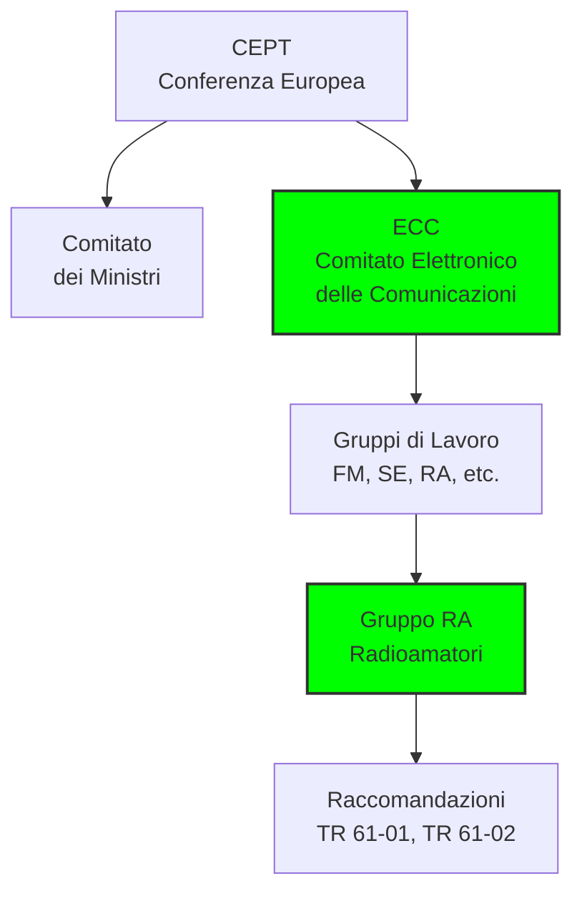
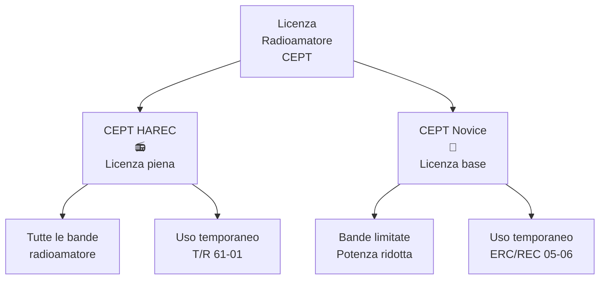
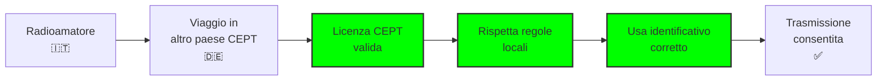

> [!WARNING]
> Questi sono **appunti personali** e possono contenere errori o imprecisioni.
> Non sostituiscono libri di testo o fonti ufficiali.
> Il materiale è soggetto a revisione continua grazie al contributo volontario della comunità.
> [Contribuisci su GitHub](https://github.com/IU6VYG/esame-radioamatori)

# C.2 Regolamentazione della CEPT: L'Europa Unita nelle Radiofrequenze 📻🇪🇺

Benvenuti nel mondo della regolamentazione europea! La **Conferenza Europea delle Amministrazioni delle Poste e delle Telecomunicazioni (CEPT)** coordina le politiche radiocomunicative in Europa. Per i radioamatori, la CEPT significa libertà di operare temporaneamente in altri paesi europei con la propria licenza. Scopriamo insieme questo sistema che facilita le nostre attività transfrontaliere!

## 🏛️ Che cos'è la CEPT?

La **Conferenza Europea delle Amministrazioni delle Poste e delle Telecomunicazioni (CEPT)** è un'organizzazione intergovernativa fondata nel 1959 che coordina le politiche di telecomunicazioni in Europa.

### Membri della CEPT

- **48 paesi europei**: Tutti i paesi dell'UE più alcuni paesi vicini
- **Italia**: Membro fondatore dal 1959
- **Obiettivo**: Armonizzazione delle normative telecomunicative

### Organizzazione della CEPT

## 📋 Raccomandazione T/R 61-02: Classi di Licenza CEPT

La **Raccomandazione T/R 61-02** definisce il sistema armonizzato di licenze radioamatoriali in ambito CEPT. Il sistema prevede **due livelli** di licenza, basati sul certificato d'esame.

### Classi di Licenza

| Classe | Certificato | Bande | Esame | Note |
|--------|------------|-------|-------|------|
| **CEPT (HAREC)** | HAREC | Tutte le bande radioamatore | Esame completo (Racc. T/R 61-02) | Licenza piena, riconosciuta in tutti i paesi CEPT |
| **CEPT Novice** | ERC/REC 05-06 | Limitate (sottoinsieme bande) | Esame di livello base | Principiante, bande e potenza ridotte |

La potenza massima è stabilita dall'amministrazione nazionale di ciascun paese.

### Condizioni Generali

- **Validità**: Riconosciuta in tutti i paesi aderenti alla Raccomandazione
- **Codice Morse**: Non richiesto per l'esame dal 2003
- **Esame HAREC**: Copre tecnica, regolamentazione e pratica operativa

### Diagramma Classi CEPT

## 🗺️ Raccomandazione TR 61-01: Utilizzo Temporaneo

La **Raccomandazione TR 61-01** permette l'uso temporaneo delle stazioni radioamatore in paesi CEPT diversi dal proprio.

### Condizioni per l'Utilizzo Temporaneo

1. **Licenza valida**: Licenza nazionale equivalente alla CEPT (vedi tabella T/R 61-01 Annex 2)
2. **Periodo**: Per la durata del soggiorno temporaneo (non è fissato un limite specifico nella T/R 61-01; singoli paesi possono prevedere restrizioni)
3. **Identificazione**: Prefisso del paese ospitante + "/" + proprio indicativo nazionale (Sezione 2.3 T/R 61-01)
4. **Rispetto normative locali**: Bande, potenza e condizioni tecniche del paese visitato
5. **Nessuna tariffa**: Nessun diritto amministrativo né canone di frequenza nel paese visitato

### Esempio Pratico
Un radioamatore italiano (IK0AAA) in vacanza in Germania:
- Usa licenza italiana HAREC (Classe A)
- Identificativo: DL/IK0AAA (prefisso DL dalla tabella T/R 61-01 + proprio indicativo, separati da "/")
- Potenza massima: Rispettare i limiti del paese visitato
- Durata: Per la durata del soggiorno temporaneo

### Procedure di Utilizzo Temporaneo

## 🌍 Paesi Non Membri CEPT

La T/R 61-01 prevede che anche paesi **non CEPT** possano aderire al sistema di licenza CEPT (Annex 3 e 4). I paesi non-CEPT aderenti includono:

### Paesi Non-CEPT Aderenti (Annex 4 T/R 61-01)

- **Australia** (VK), **Canada** (VE), **USA** (W/K)
- **Nuova Zelanda** (ZL), **Sud Africa** (ZS)
- **Israele** (4X/4Z), **Perù** (OA)

:::note
Svizzera (HB9), Norvegia (LA), Islanda (TF) e Regno Unito (M) **sono membri CEPT** a pieno titolo e figurano nella tabella Annex 2 della T/R 61-01. Il sistema si applica direttamente senza bisogno di accordi bilaterali.
:::

### Condizioni per Paesi Non-CEPT Aderenti

- **Statement of Conformity**: L'amministrazione non-CEPT presenta una dichiarazione di conformità (SOC) al HAREC
- **Approvazione ECC**: Necessaria l'approvazione del Comitato Elettronico delle Comunicazioni
- **Limitazioni**: Possibili restrizioni specifiche indicate nelle note della tabella Annex 4

## 📊 Benefici per i Radioamatori

### Libertà di Movimento

- **Viaggi**: Operare in vacanza senza burocrazia
- **Contest**: Partecipare a gare internazionali
- **DX**: Migliorare il punteggio con prefissi diversi
- **Amicizie**: Conoscere radioamatori locali

### Esempio di Utilizzo Temporaneo

| Situazione | Identificativo | Note |
|------------|----------------|------|
| Italiano in Francia | F/IK0AAA | Prefisso "F" da T/R 61-01 Annex 2 |
| Tedesco in Italia | I/DL1ABC | Prefisso "I" da T/R 61-01 Annex 2 |
| Spagnolo in Portogallo | CT7/EA1BCD | Prefisso "CT7" da T/R 61-01 Annex 2 |

I suffissi /P (portable) o /M (mobile) possono essere aggiunti secondo le convenzioni nazionali.

### Limitazioni Importanti

- **Non commerciale**: Solo uso personale
- **Rispetto**: Seguire sempre le regole locali
- **Emergenze**: Dare priorità ai soccorsi
- **Interferenze**: Evitare disturbi ad altri servizi

## 🔄 Sistema di Riconoscimento

### Come Funziona il Riconoscimento

1. **Licenza nazionale**: Rilasciata dal proprio paese
2. **Classe CEPT**: Determinazione automatica
3. **Validità**: Riconosciuta in tutti i paesi CEPT
4. **Aggiornamenti**: Pubblicati sul sito CEPT

### Verifica della Validità

- **Sito web CEPT**: Database delle licenze
- **Certificato**: Documento fisico (opzionale)
- **Contatti locali**: Associazioni radioamatoriali

## 📈 Evoluzione della CEPT

### Storia della CEPT

- **1959**: Fondazione come organizzazione postale
- **1980s**: Focus sulle telecomunicazioni
- **1990s**: Liberalizzazione del mercato
- **2000s**: Armonizzazione radioamatore
- **Oggi**: 48 paesi membri

### Futuro della CEPT

- **Nuove tecnologie**: SDR, satelliti, IoT
- **Spettro**: Gestione frequenze 5G/6G
- **Sostenibilità**: Riduzione impatto ambientale
- **Inclusione**: Accessibilità per tutti

## 🧠 Quiz di Ripasso

Testa le tue conoscenze sulla regolamentazione CEPT!

### Domanda 1: Qual è l'obiettivo principale della CEPT per i radioamatori?
- A) Limitare le trasmissioni
- B) Facilitare l'uso temporaneo in Europa
- C) Tassare le licenze
- D) Vietare le comunicazioni internazionali

  
Risposta

  
<strong>B) Facilitare l'uso temporaneo in Europa</strong>

  
La CEPT permette ai radioamatori di operare temporaneamente in altri paesi europei con la propria licenza.

### Domanda 2: Quante classi di licenza prevede il sistema CEPT?
- A) 1
- B) 2
- C) 3
- D) 4

  
Risposta

  
<strong>B) 2</strong>

  
Il sistema CEPT prevede due classi: CEPT HAREC (licenza piena) e CEPT Novice (licenza base).

### Domanda 3: Cosa prevede la T/R 61-01 riguardo alla durata dell'utilizzo temporaneo?
- A) Massimo 1 settimana
- B) Massimo 3 mesi per anno
- C) Per la durata del soggiorno temporaneo
- D) Illimitato senza restrizioni

  
Risposta

  
<strong>C) Per la durata del soggiorno temporaneo</strong>

  
La T/R 61-01 prevede la validità "for the duration of their temporary stays". Non fissa un limite numerico specifico; eventuali limiti temporali possono essere stabiliti dai singoli paesi.

### Domanda 4: Come si identifica una stazione in utilizzo temporaneo?
- A) Solo con l'indicativo italiano
- B) Indicativo paese ospite + proprio indicativo
- C) Indicativo speciale CEPT
- D) Nessuna identificazione speciale

  
Risposta

  
<strong>B) Indicativo paese ospite + proprio indicativo</strong>

  
Ad esempio: F/IK0AAA per un italiano in Francia (il suffisso /P può essere aggiunto secondo le convenzioni locali).

### Domanda 5: Quale certificato consente l'uso temporaneo secondo la T/R 61-01?
- A) Solo CEPT Novice
- B) HAREC
- C) Qualsiasi licenza nazionale
- D) Non è possibile l'uso temporaneo

  
Risposta

  
<strong>B) HAREC</strong>

  
Il certificato HAREC (Harmonised Amateur Radio Examination Certificate) consente l'uso temporaneo in tutti i paesi aderenti alla T/R 61-01.

## Conclusione

La CEPT rappresenta un modello di successo di cooperazione europea nelle telecomunicazioni. Per i radioamatori, significa libertà di esplorare l'etere europeo senza barriere burocratiche. Rispettare queste regole garantisce a tutti noi un'esperienza radioamatoriale sicura e piacevole in tutto il continente! 📻🇪🇺

---

:::info[📖 Fonti e riferimenti normativi]
Questa pagina tratta gli argomenti della **Sezione C.2** del Programma d'esame per il conseguimento della patente di radioamatore ([Sub Allegato D al D.Lgs. 259/2003](https://www.mimit.gov.it/images/stories/documenti/allegati/Allegato_n_26_al_CdC_testo_vigente.pdf)).

Fonti primarie:
- [Raccomandazione CEPT T/R 61-01](https://docdb.cept.org/download/2ae38a89-e58a/TR6101.pdf) — Licenza CEPT di radioamatore (uso temporaneo nei paesi CEPT e non-CEPT aderenti)
- [Raccomandazione CEPT T/R 61-02](https://docdb.cept.org/download/4424) — Esame armonizzato HAREC per radioamatori
:::
