# C.2 Regolamentazione della CEPT: L'Europa Unita nelle Radiofrequenze 📻🇪🇺

Benvenuti nel mondo della regolamentazione europea! La **Conferenza Europea delle Amministrazioni delle Poste e delle Telecomunicazioni (CEPT)** coordina le politiche radiocomunicative in Europa. Per i radioamatori, la CEPT significa libertà di operare temporaneamente in altri paesi europei con la propria licenza. Scopriamo insieme questo sistema che facilita le nostre attività transfrontaliere!

## 🏛️ Che cos'è la CEPT?

La **Conferenza Europea delle Amministrazioni delle Poste e delle Telecomunicazioni (CEPT)** è un'organizzazione intergovernativa fondata nel 1959 che coordina le politiche di telecomunicazioni in Europa.

### Membri della CEPT

- **48 paesi europei**: Tutti i paesi dell'UE più alcuni paesi vicini
- **Italia**: Membro fondatore dal 1959
- **Obiettivo**: Armonizzazione delle normative telecomunicative

### Organizzazione della CEPT

## 📋 Raccomandazione TR 61-02: Classe di Licenza

La **Raccomandazione TR 61-02** definisce le classi di licenza radioamatore armonizzate in Europa.

### Classi di Licenza

| Classe | Potenza | Bande | Esame | Note |
|--------|---------|-------|-------|------|
| **CEPT Novice** | 100 W | Limitate | Base | Principiante |
| **CEPT 1** | 100 W | Tutte HF + VHF/UHF | Completo | Standard |
| **CEPT 2** | 750 W | Tutte | Completo | Potenza elevata |
| **CEPT 3** | Nessun limite | Tutte | Completo | Senza limiti |

### Condizioni Generali

- **Validità**: Riconosciuta in tutti i paesi CEPT
- **Lingua**: Inglese sufficiente per comunicazioni
- **Età minima**: 16 anni (con eccezioni)
- **Codice Morse**: Non richiesto (CEPT 1, 2, 3)

### Diagramma Classi CEPT

```mermaid
graph TD;
    Licenza["Licenza<br>Radioamatore"] --> CEPT_Novice["CEPT Novice<br>🔰<br>100W limitato"];
    Licenza --> CEPT_1["CEPT 1<br>📻<br>100W completo"];
    Licenza --> CEPT_2["CEPT 2<br>🔊<br>750W completo"];
    Licenza --> CEPT_3["CEPT 3<br>⚡<br>Potenza illimitata"];
    CEPT_Novice --> Limitato["Bande limitate<br>HF parziali"];
    CEPT_1 --> Completo["Tutte le bande<br>HF + VHF/UHF"];
    CEPT_2 --> AltaPotenza["Alta potenza<br>fino 750W"];
    CEPT_3 --> Illimitato["Nessun limite<br>di potenza"];
```

## 🗺️ Raccomandazione TR 61-01: Utilizzo Temporaneo

La **Raccomandazione TR 61-01** permette l'uso temporaneo delle stazioni radioamatore in paesi CEPT diversi dal proprio.

### Condizioni per l'Utilizzo Temporaneo

1. **Licenza valida**: Classe CEPT riconosciuta
2. **Periodo**: Massimo 3 mesi per anno per paese
3. **Identificazione**: Indicativo del paese ospitante + proprio
4. **Rispetto normative locali**: Potenza, bande, ecc.
5. **Nessuna tariffa**: Gratuito (tranne eventuali costi amministrativi)

### Esempio Pratico
Un radioamatore italiano (IK0AAA) in vacanza in Germania:
- Usa licenza italiana CEPT 1
- Identificativo: DK/IK0AAA/P (P = portable)
- Potenza massima: Minimo tra limiti italiani (100W) e tedeschi
- Durata massima: 3 mesi

### Procedure di Utilizzo Temporaneo

```mermaid
graph LR;
    Radioamatore["Radioamatore<br>🇮🇹"] --> Viaggio["Viaggio in<br>altro paese CEPT<br>🇩🇪"];
    Viaggio --> LicenzaValida["Licenza CEPT<br>valida"];
    LicenzaValida --> RispettaRegole["Rispetta regole<br>locali"];
    RispettaRegole --> Identificazione["Usa identificativo<br>corretto"];
    Identificazione --> Trasmissione["Trasmissione<br>consentita<br>✅"];
    classDef procedura fill:#0f0,stroke:#333,stroke-width:2px;
    class LicenzaValida,RispettaRegole,Identificazione procedura;
```

## 🌍 Paesi Non Membri CEPT

Alcuni paesi non europei partecipano al sistema CEPT attraverso accordi bilaterali.

### Paesi Partecipanti

- **Svizzera**: Accordo speciale con UE
- **Regno Unito**: Dopo Brexit, mantiene accordi
- **Norvegia, Islanda**: Partecipano attivamente
- **Alcuni paesi balcanici**: In fase di adesione

### Condizioni per Paesi Non Membri

- **Stesso sistema**: TR 61-01 applicabile
- **Accordi bilaterali**: Tra paese ospite e paese d'origine
- **Limitazioni**: Possibili restrizioni su alcune bande

## 📊 Benefici per i Radioamatori

### Libertà di Movimento

- **Viaggi**: Operare in vacanza senza burocrazia
- **Contest**: Partecipare a gare internazionali
- **DX**: Migliorare il punteggio con prefissi diversi
- **Amicizie**: Conoscere radioamatori locali

### Esempio di Utilizzo Temporaneo

| Situazione | Identificativo | Note |
|------------|----------------|------|
| Italia in Francia | F/IK0AAA/P | P = Portable |
| Germania in Italia | I/DL1ABC/M | M = Mobile |
| Spagna in Portogallo | CT/EA1BCD | Senza suffisso |

### Limitazioni Importanti

- **Non commerciale**: Solo uso personale
- **Rispetto**: Seguire sempre le regole locali
- **Emergenze**: Dare priorità ai soccorsi
- **Interferenze**: Evitare disturbi ad altri servizi

## 🔄 Sistema di Riconoscimento

### Come Funziona il Riconoscimento

1. **Licenza nazionale**: Rilasciata dal proprio paese
2. **Classe CEPT**: Determinazione automatica
3. **Validità**: Riconosciuta in tutti i paesi CEPT
4. **Aggiornamenti**: Pubblicati sul sito CEPT

### Verifica della Validità

- **Sito web CEPT**: Database delle licenze
- **Certificato**: Documento fisico (opzionale)
- **Contatti locali**: Associazioni radioamatoriali

## 📈 Evoluzione della CEPT

### Storia della CEPT

- **1959**: Fondazione come organizzazione postale
- **1980s**: Focus sulle telecomunicazioni
- **1990s**: Liberalizzazione del mercato
- **2000s**: Armonizzazione radioamatore
- **Oggi**: 48 paesi membri

### Futuro della CEPT

- **Nuove tecnologie**: SDR, satelliti, IoT
- **Spettro**: Gestione frequenze 5G/6G
- **Sostenibilità**: Riduzione impatto ambientale
- **Inclusione**: Accessibilità per tutti

## 🧠 Quiz di Ripasso

Testa le tue conoscenze sulla regolamentazione CEPT!

### Domanda 1: Qual è l'obiettivo principale della CEPT per i radioamatori?
- A) Limitare le trasmissioni
- B) Facilitare l'uso temporaneo in Europa
- C) Tassare le licenze
- D) Vietare le comunicazioni internazionali

  
Risposta

  
<strong>B) Facilitare l'uso temporaneo in Europa</strong>

  
La CEPT permette ai radioamatori di operare temporaneamente in altri paesi europei con la propria licenza.

### Domanda 2: Qual è la potenza massima per una licenza CEPT 1?
- A) 10 W
- B) 100 W
- C) 750 W
- D) Nessun limite

  
Risposta

  
<strong>B) 100 W</strong>

  
La classe CEPT 1 permette fino a 100 W di potenza in tutte le bande radioamatore.

### Domanda 3: Quanto tempo può durare l'utilizzo temporaneo in un paese CEPT?
- A) 1 settimana
- B) 1 mese
- C) 3 mesi per anno
- D) Illimitato

  
Risposta

  
<strong>C) 3 mesi per anno</strong>

  
La TR 61-01 permette massimo 3 mesi di utilizzo temporaneo per anno in ciascun paese.

### Domanda 4: Come si identifica una stazione in utilizzo temporaneo?
- A) Solo con l'indicativo italiano
- B) Indicativo paese ospite + proprio indicativo
- C) Indicativo speciale CEPT
- D) Nessuna identificazione speciale

  
Risposta

  
<strong>B) Indicativo paese ospite + proprio indicativo</strong>

  
Ad esempio: F/IK0AAA/P per un italiano in Francia.

### Domanda 5: Quante classi di licenza definisce la TR 61-02?
- A) 1
- B) 2
- C) 3
- D) 4

  
Risposta

  
<strong>D) 4</strong>

  
Le classi sono: CEPT Novice, CEPT 1, CEPT 2, e CEPT 3.

## Conclusione

La CEPT rappresenta un modello di successo di cooperazione europea nelle telecomunicazioni. Per i radioamatori, significa libertà di esplorare l'etere europeo senza barriere burocratiche. Rispettare queste regole garantisce a tutti noi un'esperienza radioamatoriale sicura e piacevole in tutto il continente! 📻🇪🇺

---
<parameter name="filePath">C_Regolamentazione/2_Regolamentazione_CEPT.md
