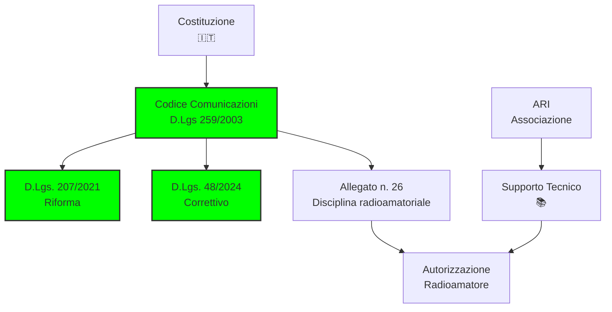
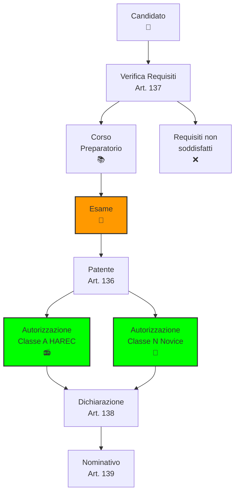
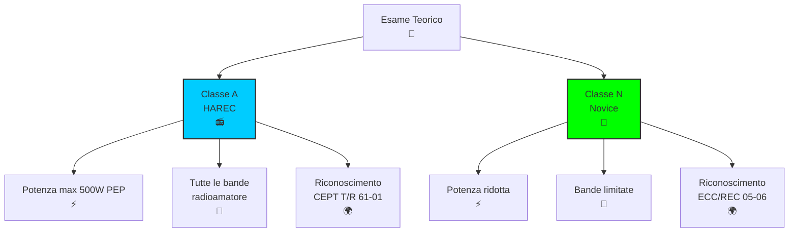
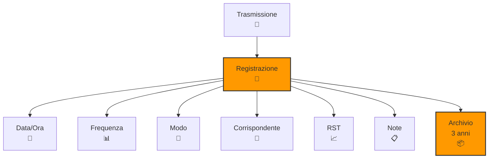

> [!WARNING]
> Questi sono **appunti personali** e possono contenere errori o imprecisioni.
> Non sostituiscono libri di testo o fonti ufficiali.
> Il materiale è soggetto a revisione continua grazie al contributo volontario della comunità.
> [Contribuisci su GitHub](https://github.com/IU6VYG/esame-radioamatori)

# C.3 Legislazione Nazionale: Le Regole Italiane per Radioamatori 📻🇮🇹

Benvenuti nel mondo della legislazione italiana per le radiocomunicazioni! In Italia, l'attività radioamatoriale è regolata dal **D.Lgs. 259/2003** (Codice delle comunicazioni elettroniche), significativamente riformato dal **D.Lgs. 207/2021** (recepimento della Direttiva UE 2018/1972) e ulteriormente modificato dal **D.Lgs. 48/2024**. Come radioamatori italiani, dobbiamo conoscere queste normative per operare legalmente e contribuire al progresso della tecnica. Scopriamo insieme il quadro legislativo che governa le nostre trasmissioni!

## 🏛️ Quadro Legislativo Italiano

La legislazione italiana per le radiocomunicazioni si basa su diversi livelli normativi.

### Leggi Fondamentali

1. **Codice delle Comunicazioni Elettroniche** (D.Lgs. 259/2003), aggiornato con:
   - **D.Lgs. 207/2021** — recepimento della Direttiva (UE) 2018/1972 (Codice europeo delle comunicazioni elettroniche)
   - **D.Lgs. 48/2024** — disposizioni correttive al D.Lgs. 207/2021
2. **Allegato n. 26 al D.Lgs. 259/2003**: Disciplina dell'attività radioamatoriale (norme tecniche e procedurali)
3. **Decreti Ministeriali**: Procedure per esami e licenze (es. DM 21 luglio 2005)

### Autorità Competente

- **Ministero delle Imprese e del Made in Italy (MIMIT)**: Autorità principale (ex MISE)
- **Garante per la Protezione dei Dati Personali**: Privacy
- **Ispettorato Territoriale**: Controlli locali
- **ARI (Associazione Radioamatori Italiani)**: Supporto tecnico

### Diagramma Quadro Legislativo

## 📋 Requisiti per l'Autorizzazione Generale

Per ottenere l'Autorizzazione Generale di radioamatore in Italia sono necessari specifici requisiti.

### Requisiti (Art. 137 D.Lgs. 259/2003)

- **Età minima**: 14 anni (con dichiarazione di consenso e assunzione di responsabilità civile da parte di chi esercita la potestà o la tutela — Art. 138 comma 2 lett. b)
- **Cittadinanza**: UE o SEE, oppure paesi con accordi di reciprocità, oppure residenti in Italia (Art. 137 comma 1 lett. a)
- **Patente**: Possesso della patente di operatore di classe A o classe N (Art. 136)
- **Assenza condanne**: Non aver riportato condanne per delitti non colposi a pena restrittiva superiore a due anni; non essere sottoposti a misure di sicurezza e prevenzione, salvo riabilitazione (Art. 137 comma 1 lett. d)

### Esame e Patente (Art. 136)

Per il conseguimento dell'autorizzazione generale è necessario possedere la **patente di operatore** (Art. 136 comma 1), ottenibile superando le relative prove di esame:

- **Classe A (HAREC)**: Esame completo secondo la Raccomandazione CEPT T/R 61-02 — copre tecnica, regolamentazione e pratica operativa. Il superamento consente il rilascio del certificato **HAREC**, riconosciuto in tutti i paesi CEPT
- **Classe N (Novice)**: Esame di livello base secondo la Raccomandazione CEPT ECC/REC (05)06 — criteri e modalità stabiliti con decreto del Ministro

Il Ministero può affidare l'organizzazione e lo svolgimento degli esami alle **associazioni dei radioamatori legalmente riconosciute** (Art. 136 comma 3).

### Diagramma Procedure Autorizzazione

## 📊 Tipi di Autorizzazione (Art. 135 D.Lgs. 259/2003)

Il sistema italiano prevede **due classi** di autorizzazione generale (introdotte con la riforma del D.Lgs. 207/2021):

### Tabella delle Classi

| Aspetto | Classe A (HAREC) | Classe N (Novice) |
|---------|------------------|-------------------|
| **Raccomandazione CEPT** | T/R 61-01 | ECC/REC (05)06 |
| **Esame** | Completo (T/R 61-02 HAREC) | Livello base |
| **Bande** | Tutte le bande radioamatore | Limitate (da definire con DM) |
| **Potenza massima** | Fino a 500 W PEP | Ridotta (da definire con DM) |
| **Codice Morse** | Non richiesto | Non richiesto |
| **Uso temporaneo CEPT** | T/R 61-01 | ERC/REC 05-06 |

:::note
La Classe N è stata introdotta dall'Art. 135 comma 1 lett. b) del D.Lgs. 259/2003 (come modificato dal D.Lgs. 207/2021). I criteri e le modalità per il conseguimento della patente di classe N sono demandati a un decreto ministeriale (Art. 136 comma 1).
:::

### Bande e Potenza (Art. 135 comma 2)

Il titolare di autorizzazione generale è abilitato all'impiego di tutte le bande attribuite al servizio di radioamatore dal Piano Nazionale di Ripartizione delle Radiofrequenze, con l'osservanza e nei limiti stabiliti dall'Allegato n. 26.

### Diagramma Autorizzazione Generale

## 📝 Registro di Stazione

Ogni radioamatore deve tenere un registro delle proprie attività.

### Obblighi di Registro

- **Trattenere per 3 anni**: Tutti i registri delle trasmissioni
- **Contenuto minimo**: Data, ora, frequenza, corrispondente, modo
- **Emergenze**: Registrazione separata dei segnali di soccorso
- **Controlli**: Soggetto a verifica da parte delle autorità

### Come Tenere il Registro

#### Metodo Cartaceo
- Quaderno dedicato con colonne predefinite
- Scrittura leggibile e permanente
- Correzione con barratura singola

#### Metodo Digitale
- Software specifici (es. Ham Radio Deluxe)
- Backup regolare
- Firma digitale equivalente

### Dati da Registrare

| Campo | Descrizione | Esempio |
|-------|-------------|---------|
| **Data/Ora** | UTC o locale | 2024-01-15 14:30 UTC |
| **Frequenza** | MHz precisi | 14.250 MHz |
| **Modo** | SSB, CW, FM, etc. | SSB |
| **Corrispondente** | Indicativo | IK0AAA |
| **RST** | Rapporto segnale | 59/57 |
| **Note** | Osservazioni | QSO DX |

### Diagramma Registro di Stazione

## ⚖️ Doveri e Responsabilità

### Doveri del Radioamatore

1. **Identificazione**: Uso corretto dell'indicativo
2. **Non interferenza**: Rispetto di altri servizi
3. **Emergenze**: Priorità ai segnali di soccorso
4. **Aggiornamenti**: Mantenimento licenza valida
5. **Collaborazione**: Con autorità e associazioni

### Sanzioni (Art. 30 e seguenti D.Lgs. 259/2003)

Il D.Lgs. 259/2003 prevede sanzioni significative per le violazioni:

- **Installazione/esercizio senza autorizzazione generale**: Sanzione amministrativa pecuniaria da €30.000 a €2.500.000 (Art. 30 comma 3)
- **Violazioni gravi o reiterate** delle condizioni dell'autorizzazione generale: Sanzione da €30.000 a €600.000 (Art. 30 comma 10)
- **Interferenze dolose**: Sanzioni amministrative e penali
- **Calamità** (Art. 141): L'autorità competente può autorizzare le stazioni di radioamatore a effettuare collegamenti speciali oltre i limiti stabiliti dall'Art. 134

## 🔄 Rinnovo e Aggiornamenti

### Validità dell'Autorizzazione

- **Autorizzazione Generale (Classe A)**: 10 anni
- **Rinnovo**: Con pagamento dei diritti amministrativi
- **Aggiornamenti**: Obbligatori per cambiamenti normativi

### Procedure di Rinnovo

1. **Controllo validità**: Verifica scadenza
2. **Pagamento**: Diritti amministrativi
3. **Aggiornamento**: Nuovo certificato
4. **Registrazione**: Nel database nazionale

## 🏆 Benefici della Licenza Italiana

### Diritti e Privilegi

- **Uso spettro**: Bande dedicate radioamatore
- **Sviluppo tecnico**: Costruzione e modifica apparecchiature
- **Partecipazione**: Gare e attività internazionali
- **Riconoscimento CEPT**: Utilizzo temporaneo in Europa

### Definizione dell'Attività di Radioamatore (Art. 134)

L'attività di radioamatore consiste in un servizio di:
- **Istruzione individuale** (self-training)
- **Intercomunicazione**
- **Studio tecnico**

svolto in linguaggio chiaro o con codici internazionalmente ammessi, esclusivamente su mezzo radioelettrico (anche via satellite), da persone autorizzate che si interessano della tecnica della radioelettricità a titolo personale senza interesse economico.

L'attività può essere svolta fuori sede con apparato portatile anche su mezzo mobile, **escluso quello aereo** (Art. 134 comma 2). L'attività di **solo ascolto** sulle frequenze radioamatoriali è **libera** (Art. 134 comma 4).

### Esempio Pratico: Attività Giornaliera

Un radioamatore con Autorizzazione Generale (Classe A) può:
- Trasmettere su 40m SSB fino a 500W PEP
- Partecipare a contest internazionali
- Costruire e modificare apparecchiature (studio tecnico)
- Operare in mobilità con identificativo /M (escluso mezzo aereo)

## 🧠 Quiz di Ripasso

Testa le tue conoscenze sulla legislazione italiana!

### Domanda 1: Qual è l'età minima per ottenere una licenza radioamatore in Italia?
- A) 14 anni
- B) 16 anni
- C) 18 anni
- D) 21 anni

  
Risposta

  
<strong>A) 14 anni</strong>

  
In Italia è possibile ottenere la licenza radioamatore a 14 anni, con autorizzazione dei genitori se minorenni.

### Domanda 2: Per quanto tempo deve essere conservato il registro di stazione?
- A) 1 anno
- B) 3 anni
- C) 5 anni
- D) 10 anni

  
Risposta

  
<strong>B) 3 anni</strong>

  
Il registro di stazione deve essere conservato per almeno 3 anni ed è soggetto a controlli delle autorità.

### Domanda 3: Quante classi di autorizzazione prevede il D.Lgs. 259/2003 dopo la riforma 2021?
- A) Una sola (Classe A)
- B) Due (Classe A e Classe N)
- C) Tre (Classe A, B e C)
- D) Quattro

  
Risposta

  
<strong>B) Due (Classe A e Classe N)</strong>

  
L'Art. 135 prevede due classi: Classe A (HAREC, ai sensi della T/R 61-01) e Classe N (Novice, ai sensi della ECC/REC 05-06).

### Domanda 4: Qual è la potenza massima per l'Autorizzazione Generale di Classe A?
- A) 100 W
- B) 500 W PEP
- C) 1000 W
- D) Nessun limite

  
Risposta

  
<strong>B) 500 W PEP</strong>

  
L'Autorizzazione Generale di Classe A (HAREC) consente una potenza massima di 500 W PEP.

### Domanda 5: Quale autorità rilascia le autorizzazioni radioamatore in Italia?
- A) ARI
- B) Ministero della Difesa
- C) Ministero delle Imprese e del Made in Italy
- D) Polizia Postale

  
Risposta

  
<strong>C) Ministero delle Imprese e del Made in Italy</strong>

  
Il MIMIT (ex MISE) è l'autorità competente per il rilascio e la gestione delle autorizzazioni radioamatore.

## Conclusione

La legislazione italiana garantisce un quadro sicuro e moderno per l'attività radioamatoriale. Conoscere e rispettare queste norme non è solo un obbligo legale, ma anche una garanzia di qualità e sicurezza per tutta la comunità radioamatoriale italiana. Operiamo sempre nel rispetto delle regole per un'etere pulito e ordinato! 📻🇮🇹

---

:::info[📖 Fonti e riferimenti normativi]
Questa pagina tratta gli argomenti della **Sezione C.3** del Programma d'esame per il conseguimento della patente di radioamatore ([Sub Allegato D al D.Lgs. 259/2003](https://www.mimit.gov.it/images/stories/documenti/allegati/Allegato_n_26_al_CdC_testo_vigente.pdf)).

Fonti primarie:
- [D.Lgs. 259/2003 — Codice delle comunicazioni elettroniche](https://www.normattiva.it/uri-res/N2Ls?urn:nir:stato:decreto.legislativo:2003-08-01;259) (testo vigente su Normattiva) — Capo VII "Radioamatori" (Art. 134–144)
- [D.Lgs. 207/2021](https://www.normattiva.it/uri-res/N2Ls?urn:nir:stato:decreto.legislativo:2021-11-08;207) — Recepimento Direttiva (UE) 2018/1972 (riforma significativa del Capo Radioamatori, introduzione Classe N)
- [D.Lgs. 48/2024](https://www.normattiva.it/uri-res/N2Ls?urn:nir:stato:decreto.legislativo:2024-03-24;48) — Disposizioni correttive al D.Lgs. 207/2021
- [Allegato n. 26 — Disciplina dell'attività radioamatoriale](https://www.mimit.gov.it/images/stories/documenti/allegati/Allegato_n_26_al_CdC_testo_vigente.pdf) (testo vigente MIMIT)
:::
